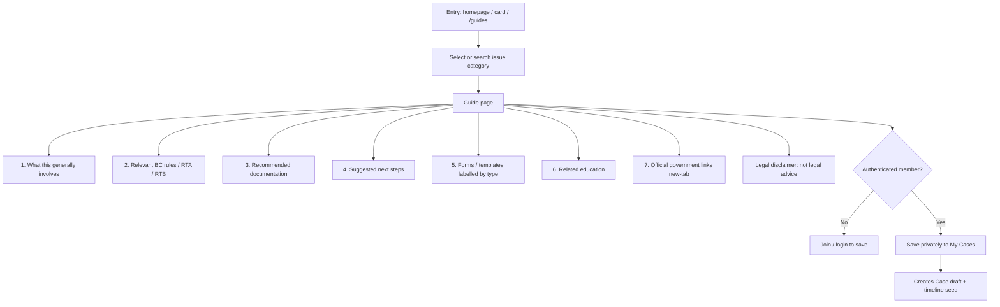
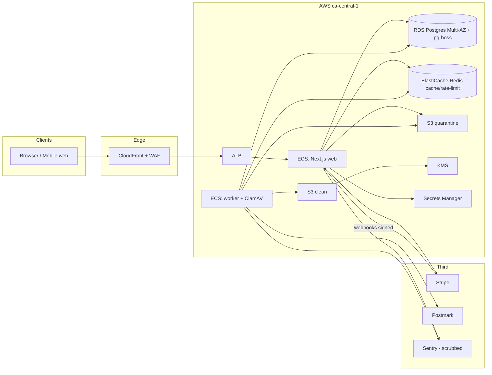
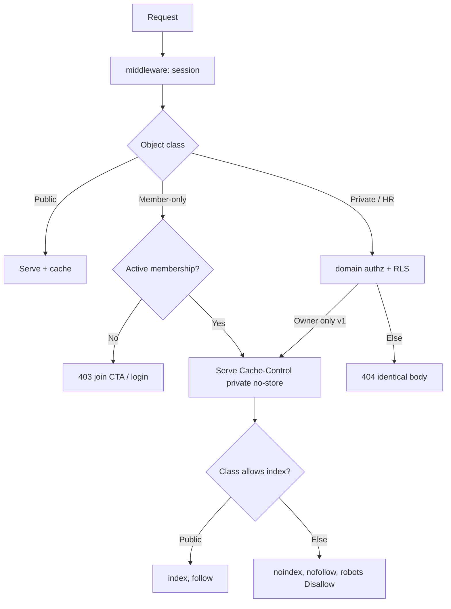
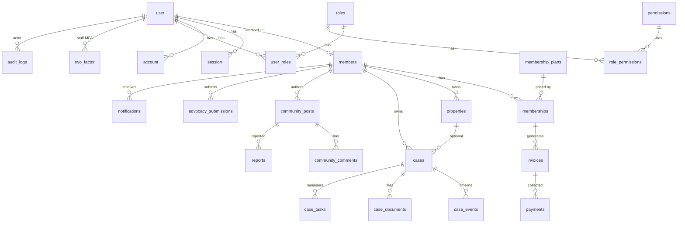
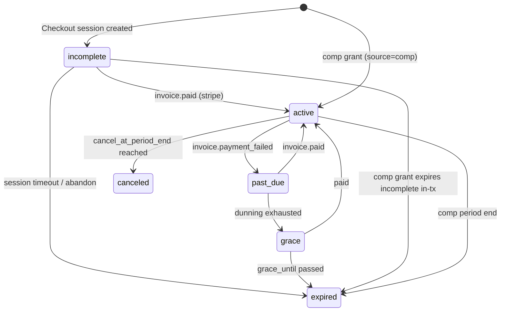
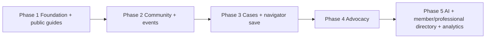

# Landlords BC — Product & Technical Architecture

| Field | Value |
|---|---|
| **Document title** | Landlords BC: Digital Home for BC Landlords — Product & Technical Architecture |
| **Working product name** | Landlords BC |
| **Author** | Architecture (draft for review) |
| **Date** | 2026-09-20 |
| **Status** | **Accepted** (user decisions incorporated, 2026-09-20) |
| **Source of truth** | `C:\Repos\landlords-bc\grok_prompt.txt` (requirements 1–52) |
| **Repo** | `C:\Repos\landlords-bc` (greenfield; no application code yet) |
| **Audience** | Senior engineers, founding product owner, future privacy/legal counsel |

This document is implementation-ready. Stack, repo layout, schema, authorization patterns, route map, visual system, phased PR plan, and extension points are specified so a senior engineer can start without guessing. Branding uses **Landlords BC**; the production hostname remains a placeholder. Numeric load assumptions are labelled as such.

---

## Overview

BC landlords currently bounce between the Residential Tenancy Branch (RTB) site, unofficial Facebook groups, generic form packs, and outdated association portals when something goes wrong with a rental. None of those surfaces combine **trustworthy education, private documentation, professional community, membership, and constructive advocacy** in one place that a first-time basement-suite owner can actually use on a phone.

**Landlords BC** is the digital home for rental-property owners in British Columbia: a premium membership platform (not a government site, not a listing site, not a “bad tenant” database) whose primary job is that a landlord thinks *“this is the place I go when I have a rental-property problem.”* The public site is a calm, BC-inspired marketing and knowledge layer. Behind login sits a SaaS-quality member workspace: membership and billing, a guided **Landlord Issue Navigator**, a private **My Cases** file, a moderated community, resources and official-form routing, events, and (later) advocacy analytics and an AI assistant that cites sources and never pretends to be a lawyer.

Guiding principle: **Simple on the surface. Powerful underneath.**

Priority order, non-negotiable: **SECURITY → PRIVACY → SIMPLICITY → TRUST → USEFULNESS → COMMUNITY → GROWTH.**

---

## Background & Motivation

### Current state

The workspace is greenfield. Only `grok_prompt.txt` and `README.md` exist. There is no framework, schema, design system, or hosting convention to inherit — those are chosen here.

The product gap in-market:

- Government sites (RTB, gov.bc.ca) are authoritative but hard to navigate, visually institutional, and not a place to document a case or ask peers.
- Legacy landlord associations often look like 2012 WordPress: cluttered IA, weak search, membership as an afterthought, little mobile craft.
- Social groups are where landlords actually talk — and where tenant-shaming, bad legal advice, and privacy leaks thrive.
- Generic proptech / listing products optimize for acquiring tenants, not for educating and protecting small landlords.

### Pain points this platform exists to remove

1. “I have a problem *today*” and cannot find the right BC rule, form, or next step in under two minutes.
2. No private, structured place to keep a rent/damage/notice timeline and documents.
3. Community that is either nonexistent or unsafe (PII, allegations-as-fact).
4. Membership products that feel like a paywall, not a professional home.
5. Advocacy that is anecdotal because nobody can report issues anonymously and in aggregate.

### Credibility constraint

The organization must remain credible to landlords, government, media, legal and housing professionals, municipalities, and the public. Tone is professional and non-adversarial. Hard prohibitions (no public bad-tenant database; no publishing tenant identifiers; no unofficial forms presented as official; no raw card storage; no frontend-only authz) are product requirements, not footnotes.

---

## Goals & Non-Goals

### Goals

- Ship a **Phase 1** public site + auth + membership/billing + member dashboard + resource centre + admin + security foundation that a landlord can join, pay for, and use on a phone.
- Make the **Landlord Issue Navigator** the signature “I have a problem” path. **Public `/guides` are a Phase 1 launch criterion** (at least N legally reviewed issue guides — see Content ops). Save-to-case is Phase 3.
- Enforce **data classification and isolation** from day one so private cases, payments, and member PII cannot leak into public search, community search, other members’ dashboards, or analytics. **Staff cannot read cases in v1.**
- Give administrators **least-privilege RBAC** (Super Admin, Content Admin, Community Moderator, Membership Admin, Advocacy Admin) from an explicit permission catalog — admin roles never imply membership, and membership entitlements never grant admin permissions.
- Leave a clean **AI provider abstraction** (default future provider: **SpaceXAI / xAI**) that is dark until Phase 5. First AI release is retrieval over **approved public/member content only**; case/document AI requires a separate PIPA gate.
- Meet **WCAG 2.2 AA**, strong Core Web Vitals, and a privacy-conscious Canadian/BC compliance posture (PIPA; PIPEDA where applicable; **CASL** for commercial email), with qualified legal review before launch.

### Non-goals (explicit)

- A public or members-visible **tenant blacklist / “bad tenant database.”**
- Tenant-facing product (applications, rent payments, listings).
- Replacing RTB, the *Residential Tenancy Act* (RTA), or legal counsel.
- Native iOS/Android apps in Phases 1–4 (responsive web + optional PWA evaluation in Phase 5).
- Hard-coded membership prices or a single frozen tier list.
- Storing raw PAN/CVV, government ID images of tenants, or unencrypted case files.
- Shipping AI in Phases 1–4.
- Claiming “100% breach-proof” or “official legal advice.”
- Aggressive popups, dark-pattern renewals, or anti-tenant marketing.
- **Multi-seat / organization memberships in v1** (one payer, many users). v1 is single-seat; `organizations` is a documented post-v1 extension.
- **Staff reading member cases in v1** (no `cases:read_any`, no `/admin/cases`, no standing bulk access).
- **Mid-cycle plan changes** in v1 (cancel-at-period-end or wait until renewal).
- **Member TOTP UI in Phase 1** (admin MFA is the launch risk; members may enable TOTP later).

### Coverage of master-prompt requirements 1–52

Every numbered requirement is either a first-class design element below or an explicit later-phase item with an extension point. Traceability:

| # | Requirement | Where it lives | Phase |
|---|---|---|---|
| 1 | Primary objective / audiences | Overview, IA, membership | 1+ |
| 2 | Simplicity first, premium not boring | Visual system, IA | 1 |
| 3 | Brand: trust, community, knowledge, professionalism, advocacy | Brand, voice | 1 |
| 4 | Homepage hero | Public site | 1 |
| 5 | Four action cards | Homepage | 1 |
| 6 | Landlord Issue Navigator | Signature feature | Public `/guides` launch criterion in 1; save in 3 |
| 7 | Member dashboard | Member app | 1 |
| 8 | Membership system + future tiers | Billing domain | 1 |
| 9 | 5-step signup | Join flow | 1 |
| 10 | Payments (tokenized, recurring, refunds) | Stripe | 1 |
| 11 | Security controls | Security | 1 |
| 12 | Privacy-by-design + legal pages | Privacy, legal | 1 |
| 13 | My Cases / My Rental Issues | Case domain | 3 |
| 14 | No bad-tenant DB; no tenant PII in community | Community safety | 2 |
| 15 | Community categories, Q&A, moderation | Community | 2 |
| 16 | Anonymous questions, identity retained | Community | 2 |
| 17 | Resource centre | Content | 1 |
| 18 | Smart search | Search | 1 public; 2 member |
| 19 | Knowledge centre article UX | Content | 1 |
| 20 | Forms & documents + official/template labels | Content | 1 |
| 21 | BC government resource integration | Content + navigator | 1–3 |
| 22 | Advocacy centre | Advocacy | 4 |
| 23 | Report an Issue + aggregates | Advocacy | 4 |
| 24 | Events | Events | 2 |
| 25 | News | Content | 1 stubs; 2 full |
| 26 | Member directory (explicit opt-in) | Profiles (Phase 2) + `/directory` (Phase 5) | 5 |
| 27 | Professional service directory | Directory | 5 |
| 28 | Admin dashboard + five roles | Admin | 1 foundation; 2–4 expand |
| 29 | In-app notifications + preferences | Notifications | 1 billing; 2 full |
| 30 | Transactional email | Email | 1 |
| 31 | Mobile-first key tasks | UX | 1–3 |
| 32 | Visual design quality bar | Design system | 1 |
| 33 | BC-inspired colour system | Tokens | 1 |
| 34 | WCAG 2.2 AA | A11y | 1 |
| 35 | Performance / CWV | Performance | 1 |
| 36 | SEO + noindex private | SEO | 1 |
| 37 | Canadian/BC compliance posture | Privacy | 1 |
| 38 | Pre-launch security testing | Checklist | pre-launch |
| 39 | Privacy-conscious analytics | Analytics | 1 |
| 40 | Homepage structure (14 blocks) | Homepage | 1 |
| 41 | Logged-out vs logged-in nav | IA | 1 |
| 42 | Membership CTAs, no popup spam | UX | 1 |
| 43 | Why Trust Us | Homepage / About | 1 |
| 44 | Community culture / guidelines | Community + legal | 1 pages; 2 enforcement |
| 45 | Future AI (cite, no hallucinated law) | AI extension | 5 |
| 46 | Relational entities | Data model | 1+ |
| 47 | Data isolation / server authz | AuthZ | 1 |
| 48 | Encrypted backups, restore tests | DR | 1 |
| 49 | Phases 1–5 | Roadmap + PR plan | all |
| 50 | Top-tier visual quality bar | Design system | 1 |
| 51 | “What do I do next?” | Homepage + navigator | 1 |
| 52 | Digital home vision + priority order | Entire doc | all |

---

## Brand, Visual Identity & UX

### Working brand (assumption)

- **Product / site name:** **Landlords BC** (accepted working brand).
- **Legal entity name:** Do **not** invent a corporation name. Invoices, privacy policy, terms, cookie banner, and email From/footer use **“Landlords BC”** until a registered legal name is supplied later.
- **Domain:** registered; **hostname still unconfirmed**. Examples use `www.landlordsbc.example` as a placeholder only. The authenticated area is **same-origin** (`/dashboard`, not `app.`). `__Host-` cookies require `Secure`, `Path=/`, and **no `Domain=` attribute**. CloudFront must forward these cookies and must not cache `/dashboard*`, `/cases*`, `/admin*`, `/api*`, or `/membership/manage*` (TTL 0). **Moving the member app to a subdomain in Phases 1–4 is forbidden** — it cannot share `__Host-` cookies and would be a breaking auth change.
- **Tagline:** “BC Landlords. Better Informed. Better Connected.”
- **Positioning line:** Resources, education, community and advocacy built specifically for rental-property owners across British Columbia.

### Content voice

Professional, calm, specific, non-adversarial. Write like a competent colleague, not a campaign.

| Do | Don’t |
|---|---|
| “Here’s what the RTB process generally involves, and the official form.” | “How to get tenants out fast.” |
| “Document dates and keep copies. This is not legal advice.” | “You are entitled to evict immediately if…” |
| “Report a concern so we can see province-wide patterns.” | “Name and shame bad tenants.” |
| “Members in your situation often look at these three resources.” | “The government is the enemy.” |

Educational copy always carries a short, visible disclaimer: *This is general information for BC rental-property owners, not legal advice. Rules change. Check official sources or a qualified professional.*

### Colour tokens (BC-inspired, not governmental)

Deep navy + charcoal + paper whites + one distinctive **Pacific teal** accent (coastal, not RTB-blue, not realtor-red, not gold-gradient “premium template”).

```css
:root {
  /* Surfaces */
  --paper-0: #FFFCF8;
  --paper-1: #F6F2EB;
  --paper-2: #E8E2D8;
  --white: #FFFFFF;

  /* Ink */
  --navy-950: #071221;
  --navy-900: #0B1F3A;
  --navy-800: #132C4E;
  --navy-700: #1C3E68;
  --charcoal-900: #1A1C1E;
  --charcoal-700: #3A3D42;
  --ink-500: #5C6168;
  --ink-400: #7A8088;

  /* Accent — Pacific teal */
  --accent-800: #0A5854;
  --accent-700: #0C6B66;
  --accent-600: #0E7C77;
  --accent-100: #E3F4F3;
  --accent-50: #F2FAF9;

  /* Semantic */
  --danger-600: #B42318;
  --success-700: #027A48;
  --warning-700: #B54708;
  --info-700: #1C3E68;

  /* Membership gold used only for badges, never large fills */
  --badge-gold: #A67C2D;

  --focus-ring: 0 0 0 3px rgba(14, 124, 119, 0.45);
  --shadow-card: 0 1px 2px rgba(7, 18, 33, 0.06), 0 8px 24px rgba(7, 18, 33, 0.06);
}
```

**Dark navy is for hero, header-on-hero, and footer only.** Body surfaces stay paper/white. Do not ship a dark-mode-by-default dashboard in Phase 1 (adds contrast risk); a restrained light dashboard with navy sidebar ink is the premium association look.

### Typography

| Role | Family | Notes |
|---|---|---|
| Display (H1, hero, section titles) | **Fraunces** (variable, `SOFT` 50, optical size) | Distinctive, editorial, not Inter-everywhere SaaS. |
| UI / body | **Plus Jakarta Sans** | Clean, slightly geometric, excellent at 16–18px. |
| Mono (case IDs, invoices, form numbers) | **IBM Plex Mono** | Canadian-designed. **Loaded only on `/cases/*`, `/membership/manage`, `/admin/*`** — public marketing pages load Fraunces + Plus Jakarta Sans only (two-family cap). |

Scale (mobile → desktop):

- Display: 40/48 → 64/72, tracking −0.02em
- H2: 28/36 → 36/44
- H3: 20/28 → 24/32
- Body: 16/26 (min); 18/30 on long-form knowledge
- Small / meta: 14/20
- Minimum touch target: 44×44 CSS px

Load fonts via `next/font` (self-hosted subsets, `font-display: swap`, max two families on public pages). No Typekit runtime, no Google Fonts CSS CDN in production (privacy + performance).

**PR-02 contrast table (required before merge):** measure accent-600, accent-700, accent-800, danger-600, success-700, warning-700, and badge-gold on `--paper-0` and `--white` for 4.5:1 (small text) and 3:1 (large). Use `--accent-800` for small teal text; `--accent-600` is allowed on large display and solid buttons with white text only if the pair passes. Gold badge is decorative on navy, never small text on paper.

### Motion

- Hero: 12–16s Ken-Burns on a single high-quality still (or a very subtle CSS gradient mesh + architectural line drawing of a Vancouver special / character house — **no cheesy stock handshake, no skyline cliché, no happy family on a lawn**).
- Cards: 150ms ease transform + shadow; no bounce.
- Page transitions: none beyond `prefers-reduced-motion`.
- `prefers-reduced-motion: reduce` disables all non-essential animation.

### Photography direction

- BC rental housing as architecture and landscape: rain on a porch, a well-kept basement-suite entrance, a mid-century walk-up, a quiet street in Kelowna / Victoria / Prince George — documentary, not listing photography.
- Commission or license a small set (6–10) of exclusive stills. Until then, use original illustration + navy/paper composition rather than Unsplash “keys in a bowl.”
- Never photograph identifiable tenants. Never use images that imply surveillance of occupants.

### Component / design-system notes

Build `packages/ui` on **Radix primitives** + Tailwind, visually **not** default shadcn. Tokens live in CSS variables; components consume tokens only.

| Component | Spec |
|---|---|
| **Primary button** | Navy fill, white text, 12px radius, 48px height on mobile. Label in sentence or short all-caps tracked 0.04em for hero CTAs only (`Join now`). |
| **Secondary button** | Paper fill, navy border 1px, navy text. |
| **Accent button** | Teal fill — used for “Continue” in flows, not for every CTA (accent scarcity). |
| **Ghost / text** | For tertiary actions. |
| **Action card** | 1:1.15 portrait on desktop grid of four; icon in 48px teal-tinted well; title + one line; entire card is the hit target. Hover: 2px lift, no colour explosion. |
| **Resource card** | Title, 2-line description, category chip, access chip (`Public` / `Members`), updated date. |
| **Access chip** | Always visible before click. Member-only cards CTA to join if logged out — do not 404. |
| **Document type chip** | `Official government form` (navy), `Organization template` (teal), `Educational example` (charcoal), `Third-party` (outline). Never style unofficial as official. |
| **Dashboard chrome** | Left nav 240px on ≥1024px; bottom tab bar on mobile (Dashboard, Cases, Resources, Community, More). Top bar: search, bell, avatar. |
| **Empty state** | Illustration-free: one sentence + one primary action. E.g. “You have no cases yet. Start from the Issue Navigator or create one.” |
| **Error / permission** | Inline field errors; page-level 403 “You don’t have access to this” with path home; never leak whether a case ID exists to a non-owner (same 404 body). |
| **Legal disclaimer callout** | Left teal rule, small body, persistent on navigator + knowledge + forms. |

### Empty, error, and permission states (required set)

- Empty dashboard widgets: each widget has its own empty copy (no “No data”).
- Search no-results: “No public resources matched. Try a category, or ask the community.” (member variant includes member-only corpus).
- Failed payment banner on dashboard (Membership Admin cannot miss it; member sees “Update billing”).
- 404 / 500: branded, no stack traces, correlation ID shown.
- Forbidden: identical response for “not found” vs “found but not yours” on private objects.
- Rate limited: 429 with retry-after, human copy.
- Offline (if PWA later): cached shell + “You’re offline; cases won’t sync.”

---

## Information Architecture & Route Map

### Sitemap (public + member + admin)

```text
Public (indexable unless noted)
├── /                          Homepage
├── /resources                 Resource centre hub
│   ├── /resources/[category]
│   └── /resources/[category]/[slug]
├── /knowledge                 Knowledge centre (long-form)
│   └── /knowledge/[slug]
├── /forms                     Forms & documents
│   └── /forms/[slug]
├── /guides                    Issue Navigator (single tree; save CTA in-page)
│   └── /guides/[issue-slug]   Public explanation + join/save gate
├── /navigator                 301 → /guides (compat only; do not build a second UI)
├── /government                BC government resource navigation layer
│   └── /government/[slug]
├── /advocacy                  Phase 1: stub (value prop + join CTA); Phase 4: full
├── /events                    Phase 1: stub; Phase 2: list + /events/[slug]
├── /community                 Phase 1: stub teaser (logged-out); member app is noindex
├── /news                      Phase 1: stub or 1–3 editorial posts; sitemap only if published
│   └── /news/[slug]
├── /about
├── /trust                     Why Trust Us (also a homepage section)
├── /membership                Plans (prices from API, never hardcoded)
├── /join                      5-step signup
├── /login  /forgot  /reset
├── /legal/privacy
├── /legal/terms
├── /legal/community-guidelines
├── /legal/cookies
├── /legal/data-retention
├── /contact
└── /robots.txt  /sitemap.xml

Member (noindex, nofollow, behind auth + active membership unless noted)
├── /dashboard
├── /cases                     My Cases (Phase 3; hidden from nav until `cases` flag)
│   └── /cases/[id]
├── /community                 (Phase 2; Phase 1 stub only)
│   ├── /community/c/[category]
│   ├── /community/p/[id]
│   └── /community/new
├── /events (member view + register)
├── /membership/manage         Status, invoices, cancel, billing portal
├── /profile                   Account, notification prefs (no public directory in Phase 2)
├── /saved                     Saved resources / docs / searches
├── /notifications
├── /directory                 Opt-in member directory (Phase 5 only; flag `directory` off until then)
└── /services                  Professional directory (Phase 5)

Admin (noindex, separate RBAC, /admin)
├── /admin                     Home (role-filtered widgets)
├── /admin/cases               DOES NOT EXIST in v1 (no staff case read)
├── /admin/members
├── /admin/memberships
├── /admin/plans               Configurable prices / Stripe mapping
├── /admin/payments
├── /admin/content/{resources,articles,forms,news,pages,government}
├── /admin/events
├── /admin/community           Moderation queue, reports
├── /admin/advocacy            Submissions + aggregates (Phase 4)
├── /admin/directory           Professional listings (Phase 5)
├── /admin/notifications       Announcements / campaigns
├── /admin/audit
├── /admin/staff               Users, roles (Super Admin only)
└── /admin/settings            Retention, feature flags, legal versions, tax_config (accountant rate; not Stripe Tax)
```

### Navigation

**Logged out (max 7 items + Login + Join):**

`Home · Resources · Community · Advocacy · Events · About · Membership` + **Log in** + **Join now**

Phase 1: Community / Advocacy / Events routes **exist as stub pages** (one-screen value prop + Join CTA — not empty chrome, not 404). They are in the nav so “what do I do next?” still resolves. `sitemap.xml` and `robots.txt` include only routes that return 200 with real content; stubs are `noindex` until the feature flag is on. Do not dump 20 mega-menu links.

**Logged in:**

`Dashboard · Resources · Community · Events · My Membership` + avatar menu (`Profile`, `Saved`, `Notifications`, `Log out`). **My Cases** is inserted after Dashboard only when the `cases` flag is on (Phase 3). Admin users see an **Admin** item if they hold any admin role.

**Profile nav (brief §41 deviation):** the brief lists Profile as a top-level logged-in item. We put it in the avatar menu to keep the primary bar ≤ 6 destinations. `/profile` remains a first-class route; the avatar is labelled with the display name for discoverability.

**Mobile logged-out:** hamburger + persistent **Join now**. **Mobile logged-in:** bottom tabs as specified.

### Homepage structure (requirement 40)

1. **Header** — transparent over hero, solid navy-on-paper after 24px scroll; logo wordmark; nav; Log in; Join now.
2. **Hero** — Fraunces headline “BC Landlords. Better Informed. Better Connected.” Support line as specified. Primary **Join now**. Secondary **Explore resources**. Subtle BC housing visual. No carousel.
3. **Issue Navigator entry** — “I have a problem” search/select: “What are you dealing with?” → typeahead of issue categories. This is above the fold on desktop after a short scroll; on mobile it sits immediately under the hero CTAs.
4. **Four action cards** — I Have a Tenant Issue / I Need a Form or Document / I Need to Understand the Rules / I Want to Join the Community.
5. **Why join** — three sentences + three proof points (privacy, BC-specific, professional community).
6. **Member benefits** — 6 items max, icon + title + 12 words.
7. **Featured resources** — 3–4 cards from CMS `featured` flag.
8. **Latest BC updates** — 3 news items with Published/Updated dates.
9. **Community activity** — **editor-picked public teasers** stored as a public CMS content type (`homepage_teasers`), never a live query of `community_posts`. Copy is written for the marketing site (no tenant facts, no member names unless consented). `/community` remains `Disallow` for the member app.
10. **Advocacy / issues** — one current initiative + link (Phase 1 can be editorial CMS; live aggregates Phase 4).
11. **Upcoming events** — 2–3.
12. **Testimonials** — named only with written consent record; otherwise role + region (“Small landlord, Vancouver Island”).
13. **Membership CTA band** — “Join the BC landlord community” + Join now. No modal interrupt.
14. **Footer** — About, legal, contact, accessibility statement, copyright **Landlords BC**, “Educational information, not legal advice.”

**Trust section (requirement 43)** appears as “Why trust us?” on `/trust` and as a condensed strip on the homepage (governance, privacy commitment, source attribution, update dates, partnerships). No unverifiable stats (“10,000 landlords protected”).

**CTAs (requirement 42):** Become a member / Join the BC landlord community / Get member access. Frequency: hero, end of gated resource, membership band. **No exit-intent popups, no toast spam, no chat widget in Phase 1.**

---

## Key User Flows

### Join (5 steps)

Price is visible **before** a password is collected. Step 1 is membership selection with live Stripe amounts (or “Billing not configured” in local/dev). Password is Step 2.

```mermaid
sequenceDiagram
  actor L as Landlord
  participant Web as Next.js
  participant API as Domain layer
  participant DB as Postgres
  participant Stripe
  participant Email as Postmark

  L->>Web: GET /join
  Web->>API: GET /api/plans (Stripe cache)
  Web->>L: Step 1 Select plan (live CAD price, entitlements)
  L->>Web: Step 2 Display name, email, password + required privacy and terms
  Note over Web: CASL is optional, unchecked by default, not required to Join
  L->>API: POST register (Better Auth) + create members row
  API->>DB: user (emailVerified=false) + members + consents (privacy, terms; casl_commercial only if checked)
  API->>Email: Verification email
  L->>Web: Step 3 Property/landlord profile (type, region, unit band)
  Note over Web: No civic address; no legal_name at join; invoices use display_name + email
  L->>Web: Step 4 Pay
  API->>Stripe: Checkout Session (customer on members.stripe_customer_id, client_reference_id=member_id, idempotent)
  Stripe-->>Web: Redirect success URL /join/confirm?session_id=
  Stripe-->>API: webhook invoice.paid (canonical)
  L->>Web: Step 5 polls GET /api/me/membership until active or timeout
  API->>Email: Welcome + receipt (transactional; CASL not required)
  L->>Web: Confirmation. If paid and !emailVerified: dashboard banner "Verify email to unlock member library"
```

Sensitive-field copy: email is the login and receipt address; region is for relevant municipal content; unit band is informational (both launch plans are **single-seat**) — never “we need your tenant’s name.” Step 1 shows the two live plans: **Individual** and **Property manager**.

**CASL on join:** Step 2 **requires** privacy + terms only. Commercial-email consent is a **separate, unchecked-by-default** control with its own copy (“Email me newsletters and advocacy updates”). It does **not** block Join. Counsel reviews the exact join screenshot as part of the CASL launch gate.

**Checkout rules:** one open Checkout session per member at a time (reuse if `incomplete` and not expired). Success URL is Step 5, which **polls membership status**; the webhook is canonical (do not activate on redirect alone). Paid-but-unverified members may log in, see billing, and resend verification; member-only forms/community remain 403 until `emailVerified`. Duplicate subscribe is prevented by `UNIQUE (member_id) WHERE status IN ('incomplete','active','past_due','grace')`.

### Login (mobile-first)

Email + password. “Send a login link” as a rate-limited fallback (Better Auth magic-link plugin). **No member TOTP UI in Phase 1.** After login: if membership lapsed → `/membership/manage` with banner; if `paid && !emailVerified` → dashboard with verify banner; else `/dashboard`.

Lockout email (only if an account exists; same generic login error in the UI): *“We paused sign-in to this account for 30 minutes after too many attempts. If this wasn’t you, use the password-reset link. We will never ask for your password by email.”* Do not include the raw IP. Rate-limit lockout mail (max 1 per 30 min per user) so it cannot be used to flood an inbox.

### Issue Navigator



Categories (seed data, admin-editable): Non-payment of rent; Late rent; Damage; Noise; Unauthorized occupants; Lease violations; Communication problems; Move-out issues; Security deposit questions; Repairs; Eviction-related questions; Dispute resolution; Other.

### Save a case (Phase 3)

From navigator “Save to My Cases” or Dashboard → New case. Fields: title, property (from member’s properties), category, status, optional notes. Default visibility `private`. Creating a case never publishes anything.

### Community post including anonymous (Phase 2)

Composer: title, category, body, attachments (images only, no PDFs of correspondence by default), toggle **Post anonymously**. Helper text: *Other members will not see your name. Moderators can still identify you if the post breaks the rules. Do not include tenant names, addresses, or accusations presented as facts.* API always stores `author_member_id`. List/detail serializers strip identity when `is_anonymous` unless actor has `community:reveal_author` (audited).

**PII detectors are advisory + queue, not auto-block.** Client-side lint is UX only (bypassable). Server-side rules (authoritative):

| Rule | Action |
|---|---|
| Regex: E.164 / NA phones, email addresses, Canadian SIN-like (`###-###-###`), `http(s)://` to non-allowlisted hosts | Flag + inline warning; post goes to **pending** |
| Address-like lines (street number + suffix: St, Ave, Rd, Blvd, Cres, Place + postal code `A1A 1A1`) | Flag + pending |
| “tenant named X” / “my tenant [A-Z][a-z]+ [A-Z]” heuristics | Flag + pending (expect false positives; mods dismiss) |
| Name NER / ML | **Not in v1** |

Never auto-reject on the word “tenant”. First **three** posts from a new member always enter the moderation queue regardless of flags. Fixture corpus: `tests/contract/community-pii.test.ts` (positives: phone, email, SIN, postal+street, “tenant named Jane Doe”; negatives: “my tenant hasn’t paid”, “RTB form 10”, “Vancouver”). **Invariant test:** no schema table or column is named for tenant identity (`tenant_name`, `tenant_email`, etc. must not exist).

Mod SLA (assumption): pending queue paged if age > 4 business hours; Community Moderator role.

### Download a form

Search or `/forms/[slug]` → type chip + disclaimer → preview (PDF.js in-browser, watermark “Landlords BC copy — verify against official source” for non-official) → download via short-lived signed URL (not a public bucket path) → optional Save to member library. Official government forms: prefer **link-out** to the official URL as primary action, cached preview secondary, so we never serve a stale “official” PDF as if we were RTB.

### Report advocacy issue (Phase 4)

`/advocacy/report` (members). Category, optional region, free text (detectors **advisory**, same as community — not a silent strip that destroys evidence). **No name on the public/admin aggregate.** Row stores `member_id` as Highly Restricted. Advocacy Admin UI is histograms + de-identified snippets only — **no `member_id` in JSON**. v1 has **no staff identity lookup** and **no break-glass read path** for submissions (same posture as cases). `member_id` is stored for possible future abuse-response; no permission or UI reads it. Future elevation would reuse a single-row TTL, not a list.

---

## Proposed Design — Technical Architecture

### Recommended stack

| Layer | Choice | Why |
|---|---|---|
| Language | TypeScript (current stable at PR-01), strict | One graph across web, worker, UI, schema. |
| Web | **Next.js App Router** (current stable at kickoff; **Node runtime** for domain/auth — not Edge for those). Constraint: React Server Components for public pages. `output: 'standalone'` for Fargate. | SSR/SSG for public SEO; RSC for paper pages; same-origin cookies; Server Actions for forms. |
| UI | Tailwind CSS + Radix + `packages/ui` | Full control of the visual bar; no generic template look. |
| API | Next.js Route Handlers + `packages/domain` | HTTP is a delivery detail. Domain is testable without Next. |
| Worker | **`apps/worker`** polling **pg-boss** (Postgres-backed jobs) | Durable email, dunning, malware promotion, reminders, search refresh. Not in the request path. |
| DB | **PostgreSQL** (current stable at PR-01, not older than 16) on AWS RDS Multi-AZ, `ca-central-1` | Relational model; RLS; FTS; Canadian residency; job queue. |
| ORM | **Drizzle ORM** | SQL-shaped, migrations as code, no hidden queries. |
| Auth | **Better Auth** (email/password + magic link; TOTP plugin for **staff only** in Phase 1) | Schema from `@better-auth/cli generate`; `members` is a 1:1 extension. See identity mapping. |
| Passwords | **Argon2id** (Better Auth credential account.password) | Memory-hard; never a homemade `users.password_hash`. |
| Payments | **Stripe Billing** + Checkout + Customer Portal + webhooks | PCI DSS SAQ A; CAD; subscriptions; no PAN on our disk. |
| Files | **S3** `ca-central-1`, SSE-KMS, private, signed URLs (**120 s**) | Isolation per member prefix; quarantine bucket. |
| Malware | **ClamAV on `apps/worker`** (not Lambda in Phase 1) | One runtime; gate before object is readable. |
| Email | **Postmark** (transactional + CASL-consented broadcasts) | Deliverability; SES is the fallback. |
| Search | **Postgres FTS + `pg_trgm`** via `packages/search` (Phases 1–4); Typesense adapter later | No private corpus in a US SaaS. |
| Cache / rate limit | **Redis** (ElastiCache, TLS, `ca-central-1`) | Cache + rate limits **only**. Not sessions, not jobs. |
| CMS | **Postgres-backed** custom admin (this app) | Not WordPress. Legal pages versioned. TipTap for articles. |
| Hosting | **AWS `ca-central-1` (Montréal)** — ECS Fargate (web + worker) behind ALB + CloudFront | Data residency. `next start` on the standalone output. |
| CDN / WAF | CloudFront + **AWS WAF** rate/bot rules + **Turnstile** widget on join/login/post | No Cloudflare proxy; Turnstile does not require one. |
| Secrets | AWS Secrets Manager; GitHub OIDC deploy | No long-lived AWS keys in GitHub. |
| Observability | OpenTelemetry → **Amazon Managed Grafana**; **Sentry** (PII scrubbing) with DPA; CloudWatch alarms | One Grafana choice. If counsel rejects US Sentry, Glitchtip in ca-central-1. |
| Analytics | **Plausible self-hosted in `ca-central-1`** (no session replay) | No PostHog. Plausible Cloud + DPA is a shrink option only, like App Runner vs ECS. |
| Feature flags | `feature_flags` table | Phase gates (community, cases, AI). |
| IaC | **Terraform** in `infra/terraform` | Repeatable staging/prod. |
| CI | GitHub Actions | Lint, typecheck, unit, contract authz tests, `pnpm audit`, container scan. |
| Deploy | GitHub Actions OIDC → ECR → ECS; **migrations as a one-shot ECS task before new tasks receive traffic** — never `drizzle migrate` inside the web container at boot | Forward-only expand-contract. |
| E2E | Playwright | Join, login, isolation (member A cannot GET member B case). |
| Email templates | **React Email** in `packages/emails` | Matches brand; mobile-first. |

**Canadian data posture:** all systems of record (Postgres, S3, backups) in `ca-central-1`. Redis holds no durable PII (rate-limit counters / HTML cache). CloudFront may cache **public** assets at the edge (including US edges). Private HTML and APIs are `Cache-Control: private, no-store`. Subprocessors (Stripe, Postmark, Turnstile, HIBP, GitHub, Sentry, AWS, Cloudflare Turnstile) are listed in the privacy policy. Card data never lands on our disk.

### System architecture



### Alternatives considered (architecture)

**A. Next.js full-stack + domain package + worker (recommended).**  
Pros: one language, excellent public SEO, simple cookie auth, small team velocity, RSC for knowledge pages. Cons: background work must be a *separate* process (we do that); CPU-heavy malware scan not in Next. Mitigate with `apps/worker`.

**B. Separate NestJS/Fastify API + Next.js SPA/RSC frontend.**  
Pros: clearer mobile-app API later, independent scale. Cons: CORS, two auth stories, duplicated types unless a third package exists anyway, slower Phase 1. Revisit if a native app is funded; `packages/domain` is the extraction seam.

**C. Traditional CMS (WordPress/Craft) + bolted-on member app.**  
Pros: editors move fast on news. Cons: fails the quality bar, membership/PII on PHP plugins, split identity, historically the look we are forbidden to ship. Rejected.

**Decision:** A. Public pages are React Server Components with streamed HTML. Mutations go through Route Handlers (JSON) or Server Actions (forms) that call `packages/domain` only — **no SQL in React components.** Auth and hosting alternatives are in [Alternatives Considered](#alternatives-considered).

**Infra cost assumption (Y1, labelled):** AWS ca-central-1 baseline for this footprint is **~$800–2,000 USD/month** at 800 members (RDS Multi-AZ `db.t4g.medium`, 2× Fargate 0.5 vCPU/1 GB, ElastiCache `cache.t4g.micro`, S3, CloudFront, WAF, Managed Grafana, NAT). If the association cannot bear that before revenue, shrink hosting to **App Runner + RDS** in the same region without changing the domain model — do not move systems of record to Vercel US.

### Quantified assumptions (labelled)

| Assumption | Value | Use |
|---|---|---|
| Y1 paying members | **800** conservative / **2,000** stretch | Capacity, Stripe, support load |
| Y3 members | **5,000** | Schema/index planning |
| Concurrent sessions typical / peak | **100 / 500** | ECS size, DB connections (PgBouncer) |
| Avg properties / member | **1.6** | |
| Cases / active member / year | **2** | Phase 3 storage |
| Files / case × avg size | **4 × 1.5 MB** | S3: ~10–40 GB Y1 |
| Knowledge + resource corpus Y1 | **200–400** documents | FTS is enough |
| Public TTFB (p95, CA) | **< 200 ms** cached; **< 400 ms** dynamic | |
| LCP public homepage 4G | **< 2.0 s** (budget 1.8 s) | |
| INP | **< 200 ms** | |
| Search p95 | **< 150 ms** in-region | |
| API p95 (non-file) | **< 200 ms** | |
| Error rate SLO | **< 1% 5xx** on 5-minute windows (page if exceeded 10 min) | |
| Signed URL TTL | **120 s** | |
| Backup RPO / RTO | **15 min / 4 h** | |
| Session lifetime | **14 d** idle, 30 d absolute; admin **8 h** absolute, 30 min idle | |
| **Y1 sizing** | RDS `db.t4g.medium` Multi-AZ; PgBouncer **50** server connections; **2×** Fargate web 512 CPU / 1024 MB (`max_connections` per task ≤ 10); **1×** worker 512/1024 (ClamAV may need 1024/2048); Redis `cache.t4g.micro` | 500 peak sessions must not open 20 PG conns × N tasks |
| Email volume at renewal | **~800–2,000** renewal mails in a 7-day window Y1; Postmark handles it | |
| WAF | Rate-based rules; **do not enable AWS WAF Bot Control** in Y1 unless attacked (cost) | |
| ClamAV CPU | Burst on upload; scan timeout 60 s; alert `pending` > 10 min | |
| Phase 1 team | **2–3 senior engineers × 12–16 weeks** (not a calendar commitment) | |
| Launch content | **≥ 8 of 13** issue guides legally reviewed + dated | |

---

## Repo Layout & Module Boundaries

pnpm workspaces + Turborepo.

```text
landlords-bc/
  apps/
    web/                      # Next.js App Router, output: standalone
      src/app/                # routes only: compose domain + ui
      src/middleware.ts       # cookie SHAPE / HMAC cache only — never authorize
    worker/                   # pg-boss processors + ClamAV
  packages/
    ui/                       # design system
    domain/                   # use-cases, policies, invariants
      src/authz/              # policy helpers — THE authorization core
      src/db/withActorTransaction.ts   # + withStripeWebhookTransaction, withMemberJobTransaction
      src/membership/
      src/cases/
      src/community/
      src/content/
      src/advocacy/
      src/billing/
      src/notifications/
    db/                       # drizzle schema, migrations, seeds
                              # Better Auth tables from CLI generate, not hand-rolled
    emails/                   # React Email
    search/                   # index()/query() — Postgres adapter now; Typesense later
    jobs/                     # pg-boss client, job names, idempotency keys
    ai/                       # Phase 5 provider interface; stub impl
    config/                   # eslint, tsconfig, tailwind tokens
  infra/terraform/
  tests/
    e2e/                      # Playwright
    contract/                 # authz leak tests (CI required)
  docs/
  .github/workflows/
```

**Boundary rule:** `apps/web` may import `domain`, `ui`, `db` (types), `emails`, `search`. It may not issue ad-hoc SQL. `domain` may import `db` and never import Next.js. `ai` may import `domain` types only. Workers import `domain` + `jobs`. This is how we keep authorization from rotting into “hide the button.”

**Middleware vs session (mandatory):** Next.js middleware runs on the **Edge runtime** and **must not** hit Postgres. It may (1) redirect unauthenticated *shape* (cookie missing) away from `/dashboard` and `/admin` to `/login`, and (2) read Better Auth’s HMAC `session_data` cookie cache if present. **Every** Server Component loader, Route Handler, and Server Action that authorizes calls `auth.api.getSession()` (Postgres) via a Node helper. Cookie-cache TTL **≤ 5 minutes**. Cookie cache is **disabled on `/admin/**`**. Never treat middleware as authorization. RLS GUCs are set only inside `withActorTransaction` / `withStripeWebhookTransaction` / `withMemberJobTransaction` in Node, never in `middleware.ts`.

---

## AuthN / AuthZ

### Identity mapping — Better Auth is the source of schema

We implement **option (a): Better Auth owns identity tables.** We do **not** invent `users.password_hash`, `email_verified_at`, `mfa_totp_encrypted`, or a homemade `sessions.token_hash`.

`npx @better-auth/cli generate` output is merged into `packages/db` and **not forked ad hoc**. Field/table aliases use Better Auth `modelName` / `fields` config only when we must match our naming; default plugin table names are preferred to avoid adapter drift.

#### Better Auth tables (canonical)

| Table | Role |
|---|---|
| `user` | `id`, `name` (we store **display name** here), `email`, `emailVerified` (boolean), `image`, `createdAt`, `updatedAt`, plus `additionalFields`: `status` enum(`active`,`locked`,`disabled`), `lastLoginAt` |
| `session` | Better Auth session: `id`, `expiresAt`, `token` (stored as Better Auth stores it — **do not hash in a parallel table**), `ipAddress` (live session only; revoked on erasure), `userAgent`, `userId`, `createdAt`, `updatedAt` |
| `account` | Provider links. **Credential passwords live on `account.password`** (Argon2id, Better Auth email-and-password plugin). `providerId = 'credential'` |
| `verification` | Email-verify, magic-link, and password-reset tokens |
| `two_factor` | TOTP secret + hashed backup codes (plugin). **Staff only in Phase 1.** |

Our extension (not Better Auth):

| Table | Role |
|---|---|
| `members` | 1:1 with `user` for **landlord** accounts (`user_id` unique FK). Staff users have **no** `members` row |
| `user_roles` / `roles` / `permissions` / `role_permissions` | App RBAC |
| `staff_invites` | One-time bootstrap/invite tokens |
| `auth_lockouts` optional | Prefer Redis counters; DB row only if we need audit of lockouts |

#### Plugins (Phase 1)

- `emailAndPassword` (Argon2id, min 12 chars)
- `magicLink` (fallback login; uses `verification`)
- `twoFactor` (TOTP) — enrolled **before** an admin role becomes active
- Drizzle adapter

Not in Phase 1: OAuth social, passkeys, member-facing TOTP UI (the plugin may be loaded for staff only).

#### Cookies (`__Host-` prefix, no `Domain=`)

Configured via `advanced.useSecureCookies` + `advanced.cookies.*.name`:

| Better Auth cookie | Wire name | Notes |
|---|---|---|
| `session_token` | `__Host-lbc_session` | HttpOnly; Secure; SameSite=Lax; Path=/ |
| `session_data` | `__Host-lbc_session_data` | HMAC cache; TTL **≤ 5 min**; **disabled on `/admin/**`** |
| `two_factor` | `__Host-lbc_two_factor` | Staff MFA challenge |
| `dont_remember` | `__Host-lbc_dont_remember` | If used |

Rotate session on login and on privilege change. Admin sessions: 8-hour absolute + 30-minute idle (enforced in app when `user_roles` is non-empty, by issuing a shorter `expiresAt`).

#### Passwords, HIBP, recovery

- Min 12 characters; local zxcvbn-style reject of trivial passwords.
- HIBP k-anonymity range API (prefix only). **Fail-open:** if HIBP is unreachable, allow the password (still min-length + local score). Disclose HIBP as a subprocessor.
- Recovery: Better Auth `verification` rows, 30-minute TTL, single-use. Changing email requires re-verify + session revoke.
- Email verification required before **member-only content**. Stripe can complete first; dashboard shows `paid && !emailVerified`.

#### Brute force and bots

- Redis counters per email and per IP; 5 failures / 15 min → backoff + Turnstile; 20 → 30 min lock + lockout email (rate-limited). UI always `invalid credentials` (no email enumeration).
- **AWS WAF** rate/bot rules on `/join`, `/login`, `/api/auth/*`. **Turnstile** widget on join, login (after threshold), and community post. Turnstile does not require a Cloudflare proxy.

#### CSRF / Origin / webhook allow-deny matrix

| Path | CSRF | Origin/`X-Requested-With` | Session | Turnstile | Body |
|---|---|---|---|---|---|
| Browser JSON `/api/*` (cookie auth) | SameSite + Server Action secret | **Required** Origin/Host match + `X-Requested-With` | Yes | No (except join/login/post) | Parsed JSON |
| Server Actions | Next action secret + Origin | Same-origin | Yes | As above | FormData |
| `POST /api/stripe/webhook` | **None** | **None** (Stripe has no Origin) | **None** | **None** | **Raw body**; `stripe.webhooks.constructEvent(raw, sig, secret)` |
| Better Auth handler `/api/auth/*` | Better Auth’s own | Per library | Cookie set on success | Join/login | Per library |

**Next.js raw-body gotcha:** the webhook route must run on the **Node** runtime, read `await req.text()` (not `req.json()`), and **must not** pass through a middleware that consumes the body. Disable any global JSON parser on this path. WAF: skip bot challenges on `/api/stripe/webhook`; allow Stripe’s published IP ranges if practical; still verify signature (IPs are not the security boundary). Idempotency: insert `stripe_events.id` unique before applying.

Rate-limit buckets: `/api/stripe/webhook` is **not** in the `/api/*` browser bucket.

### Super Admin bootstrap (production)

- **Forbid** `DEV_SUPERADMIN_*` env seeding in `NODE_ENV=production` (process refuses to boot if set).
- First human: generate a `staff_invites` row (CLI runbook, two-person, output once). Invitee hits `/admin/enroll?token=`, sets password, **enrolls TOTP**, stores hashed backup codes. Role `super_admin` attaches **only after** `two_factor` is verified.
- Recovery codes for that user live in the org password manager (not in git, not in Slack).
- **Sealed break-glass user:** a second `user` with `super_admin`, password split across two officers, TOTP seed in a sealed envelope/password manager. Every login pages on-call (`audit_logs` + CloudWatch alarm on `staff.break_glass_login`).
- If the only Super Admin loses TOTP: break-glass user + rotate, or a documented one-shot `staff_invites` from a maintainer with AWS console access (runbook, two-person).

### Authorization — permission catalog and role matrix

Roles live in `user_roles`. **Membership entitlements never grant admin permissions. Admin roles never imply a `members` row or a paid plan.** Staff hitting `/api/cases` receive the same 404 as strangers. A landlord Super Admin who also has a `members` row still **cannot** read other members’ cases.

**Plan entitlements** (frozen Zod schema, boolean columns on `membership_plans` — not freeform JSON):

```ts
const PlanEntitlements = z.object({
  community: z.boolean(),
  forms: z.boolean(),
  knowledge_member: z.boolean(),
  cases: z.boolean(),
  events: z.boolean(),
  directory_opt_in: z.boolean(),
});
```

Launch plans **Individual** and **Property manager** (both single-seat, both `is_active`): all entitlement booleans true except `directory_opt_in` (flag off until Phase 5). Entitlements are checked **after** RBAC, only for actors with `members`. Do not invent extra Property-manager features (no seats, no shared cases).

**Permission keys:**

| Key | Super Admin | Content Admin | Community Moderator | Membership Admin | Advocacy Admin |
|---|---|---|---|---|---|
| `staff:manage` | ✓ | | | | |
| `audit:read` | ✓ | | | | |
| `flags:write` | ✓ | | | | |
| `content:read` | ✓ | ✓ | | | |
| `content:write` | ✓ | ✓ | | | |
| `events:write` | ✓ | ✓ | | | |
| `community:moderate` | ✓ | | ✓ | | |
| `community:reveal_author` | ✓ | | ✓ | | |
| `members:read` | ✓ | | | ✓ | |
| `members:write` | ✓ | | | ✓ | |
| `billing:refund` | ✓ | | | ✓ | |
| `plans:write` | ✓ | | | ✓ | |
| `advocacy:aggregate_read` | ✓ | | | | ✓ |
| `advocacy:cms_write` | ✓ | ✓ | | | ✓ |
| `notifications:broadcast` | ✓ | | | ✓ | |
| `cases:read_any` | **omitted in v1** | — | — | — | — |

There is **no** `cases:read_any`. There is **no** `/admin/cases`. List and get of cases are **owner-only** (`members.id = session member`). Super Admin `GET /api/cases` is still owner-scoped (empty if they have no member row). Contract tests assert this.

If counsel later requires support access: implement `case_access_elevations` (`actor_user_id`, `case_id`, `reason`, `expires_at` ≤ 15 min, single case, Super Admin only) — **never** a list-all endpoint. Not in v1.

UI widgets are filtered by the same keys; hiding a nav item is not enforcement.

Membership gate: `memberships.status IN ('active','grace')` and `current_period_end > now()` (grace default 7 days after failed renewal). **Lapsed members (Key Decision):** may log in, pay, export data, and **read/export their own cases**; cannot post in community or download member-only forms.

### Policy helper pattern (mandatory)

HR/Private reads **always** go through a GUC wrapper. `getCaseForActor` takes `tx` (or calls `withActorTransaction` internally). **Ban** `db.query` / `db.select` on HR tables (`cases`, `case_*`, `properties`, `advocacy_submissions`, `invoices`, `payments`, `memberships`) outside `packages/domain/src/db/with*Transaction.ts` and `packages/domain/src/authz/*` — ESLint `no-restricted-syntax` in `packages/domain` (not only `apps/web`).

```ts
// packages/domain/src/authz/cases.ts
export async function getCaseForActor(actor: Actor, caseId: string): Promise<Case> {
  if (!actor.memberId) throw new NotFoundError(); // staff included
  return withActorTransaction(actor, async (tx) => {
    const row = await tx.query.cases.findFirst({
      where: and(eq(cases.id, caseId), eq(cases.memberId, actor.memberId)),
    });
    // Same 404 for missing and unauthorized (no existence oracle).
    if (!row) throw new NotFoundError();
    return row;
  });
}

export function casesOwnedBy(memberId: string) {
  return eq(cases.memberId, memberId);
}
```

Constant-time 404 body (fixed JSON `{ "error": "not_found" }`). **Forbid** copy such as “case does not belong to you.” `audit_logs.meta` must not include case **bodies or titles**.

List endpoints **always** apply `casesOwnedBy` from the session member inside `withActorTransaction`. Client-supplied `member_id` is ignored.

### RLS + transaction wrappers (all Private / Highly Restricted tables)

Middleware **never** sets DB session variables. App role `lbc_app` cannot bypass RLS (`FORCE`). **`members` is not RLS’d** (needed so webhooks can resolve `stripe_customer_id` → `member_id`). Three legal wrappers — no other GUC path:

```ts
export async function withActorTransaction<T>(
  actor: Actor,
  fn: (tx: Tx) => Promise<T>,
): Promise<T> {
  return db.transaction(async (tx) => {
    await tx.execute(sql`select set_config('request.user_id', ${actor.userId}, true)`);
    await tx.execute(sql`select set_config('request.member_id', ${actor.memberId ?? ''}, true)`);
    await tx.execute(sql`select set_config('request.perm_members_read', ${hasPermission(actor, "members:read") ? "on" : ""}, true)`);
    // Intentionally no request.admin_cases — v1 has no staff case read
    return fn(tx);
  });
}

/** Stripe webhooks: sessionless. Look up members (not RLS'd) then set owner GUC. */
export async function withStripeWebhookTransaction<T>(
  stripeCustomerId: string,
  fn: (tx: Tx, member: Member) => Promise<T>,
): Promise<T> {
  return db.transaction(async (tx) => {
    const member = await tx.query.members.findFirst({
      where: eq(members.stripeCustomerId, stripeCustomerId),
    });
    if (!member) throw new NotFoundError();
    await tx.execute(sql`select set_config('request.member_id', ${member.id}, true)`);
    await tx.execute(sql`select set_config('request.user_id', ${member.userId}, true)`);
    await tx.execute(sql`select set_config('request.perm_members_read', '', true)`);
    return fn(tx, member);
  });
}

/** pg-boss jobs (ClamAV, reminders). memberId is required on the job payload (set at enqueue inside withActorTransaction). */
export async function withMemberJobTransaction<T>(
  memberId: string,
  fn: (tx: Tx) => Promise<T>,
): Promise<T> {
  return db.transaction(async (tx) => {
    await tx.execute(sql`select set_config('request.member_id', ${memberId}, true)`);
    await tx.execute(sql`select set_config('request.perm_members_read', '', true)`);
    return fn(tx);
  });
}
```

Fallback if a job payload lacks `memberId`: SECURITY DEFINER function `lbc_lookup_document_owner(document_id uuid) returns uuid` (mapping columns only, granted to `lbc_app`) then `withMemberJobTransaction`. Do **not** grant table BYPASSRLS to the worker.

Use `set_config(..., is_local := true)` only inside `BEGIN`. **Never** session-level `SET`. PgBouncer transaction pooling is then safe. Contract test: two interleaved pooled clients cannot see each other’s rows.

FORCE RLS on every Private/HR table, **fail-closed** when GUCs are missing/empty:

```sql
-- Applied to: cases, case_events, case_notes, case_documents, case_tasks,
-- properties, saved_resources, notification_preferences, notifications,
-- advocacy_submissions, invoices, payments, memberships
-- invoices.member_id and payments.member_id are denormalized (not null) for RLS.
-- members is NOT in this list.

ALTER TABLE cases ENABLE ROW LEVEL SECURITY;
ALTER TABLE cases FORCE ROW LEVEL SECURITY;
CREATE POLICY cases_owner ON cases
  USING (
    nullif(current_setting('request.member_id', true), '') is not null
    AND member_id = nullif(current_setting('request.member_id', true), '')::uuid
  );

CREATE POLICY invoices_access ON invoices
  USING (
    member_id = nullif(current_setting('request.member_id', true), '')::uuid
    OR current_setting('request.perm_members_read', true) = 'on'
  );

CREATE POLICY payments_access ON payments
  USING (
    member_id = nullif(current_setting('request.member_id', true), '')::uuid
    OR current_setting('request.perm_members_read', true) = 'on'
  );

CREATE POLICY memberships_access ON memberships
  USING (
    member_id = nullif(current_setting('request.member_id', true), '')::uuid
    OR current_setting('request.perm_members_read', true) = 'on'
  );
```

Child case tables join through `case_id` to a case the GUC may see (`EXISTS (SELECT 1 FROM cases c WHERE c.id = case_id AND c.member_id = nullif(current_setting('request.member_id', true), '')::uuid)`). App role `lbc_app` is not table owner and cannot bypass RLS (`FORCE`). Migrations run as a separate migrator role.

**Contract tests (RLS + jobs + webhooks):**
- Unsigned `POST /api/stripe/webhook` → 400; no membership mutation.
- Signed `invoice.paid` **with RLS on** (`lbc_app` role) activates the membership and inserts invoice/payment for that `member_id` only.
- Scan job with `withMemberJobTransaction(owner)` flips `pending → clean` for that member’s document; the same job with another member’s id updates **0** rows.

### Identity vs membership

**Landlord users** are 1:1 `user` ↔ `members` (created together at join Step 2). **Staff** are `user` + `user_roles` **without** a `members` row and must not appear in `/directory` when that route ships in Phase 5. A user may not be in a half-join state past Step 2; abandoned Step 1 (plan selected, no account) is cookie/sessionStorage only.

---

## Data Classification & Enforcement

| Class | Examples | Access | Indexing | Retention (assumption, counsel to confirm) |
|---|---|---|---|---|
| **Public** | Marketing pages, public articles, public event blurbs, public advocacy editorials | Anonymous | Indexed, sitemap | While published |
| **Member-only** | Member articles, forms downloads, community posts, member events | Authenticated + active membership | **noindex**; not in public sitemap; not in public FTS | While useful + 30 days after unpublish |
| **Private** | Profile, saved items, notification prefs, properties, invoices metadata | Owner + Membership Admin (need to know) | Never | Account life + 7 years invoices (tax) |
| **Highly Restricted** | Cases, case docs/photos/notes, advocacy `member_id`, anonymous-post author mapping, government ID if ever collected (we will **not** collect) | **Owner only in v1.** No staff read. Advocacy Admin sees aggregates without identity. | Never; S3 bucket not crawled; `X-Robots-Tag: noindex` | Cases: member-controlled delete + 30-day backup lag; financial: 7 years |



**Search indexing rules**

- Public FTS / sitemap: `visibility = 'public'` AND `published_at IS NOT NULL` AND `deleted_at IS NULL`.
- Member FTS index: member-only content + community (body only; anonymous authors stored as `anonymous` in the index document).
- **Never indexed:** `cases`, `case_documents`, `case_notes`, `case_events`, `payments` PAN tokens (we shouldn’t have PAN), `advocacy_submissions` raw, emails, sessions, audit IP+UA except internally, member email, phone, properties.address.
- `robots.txt`: **Allow** `/`, `/resources`, `/knowledge`, `/forms`, `/guides`, `/government`, `/about`, `/trust`, `/membership`, `/join`, `/legal`, `/contact`, `/news` (published only). **Disallow** `/dashboard`, `/cases`, `/community`, `/membership/manage`, `/profile`, `/admin`, `/api`, `/saved`, `/notifications`, `/directory`. Stubs for `/events` `/advocacy` `/community` are `noindex` until flagged on. Sitemap emits only 200 public indexable URLs.
- HTML: `<meta name="robots" content="noindex, nofollow">` on all member/admin layouts + `X-Robots-Tag` header from middleware (defense if a proxy strips meta).

---

## Data Model

PostgreSQL (current stable ≥ 16), UUID PKs (`gen_random_uuid()`), `timestamptz` everywhere, soft deletes where content is moderated (`deleted_at`), hard deletes where the member exercises erasure (with legal holds).

### ER overview



Post-v1 extension (not created in v1): `organizations`, `organization_members` (seat invites), `billing_owner_user_id` ≠ case owner. v1 is **single-seat** only. Professional/corporate *pricing* can be a plan row; professional/corporate *seats* cannot.

### Core tables (section 46 + extras)

**Better Auth (do not hand-roll):** `user`, `session`, `account`, `verification`, `two_factor` — columns as generated by the CLI. `user.name` = display name. `user.emailVerified` is boolean. Credential hash is `account.password`. Optional `additionalFields` on `user`: `status`, `lastLoginAt`.

**members** (landlord extension; staff have none)

| Column | Type | Notes |
|---|---|---|
| id | uuid PK | |
| user_id | uuid unique FK `user.id` | |
| phone | text null | Optional; E.164; **never** a directory column |
| landlord_type | enum | first_time, small, multi, manager, professional |
| region | enum | Interior, Lower Mainland, Island, North, Multiple |
| unit_band | enum | `1`, `2-4`, `5-10`, `11-50`, `50+` |
| stripe_customer_id | text unique null | **One Stripe customer per member**, not per membership row |
| directory_opt_in | bool default false | Unused in UI until Phase 5 |
| directory_business_name | text null | First-class; published only if opt-in **and** `/directory` ships (Phase 5) |
| directory_region | text null | City/region, not street |
| directory_landlord_type | text null | |
| directory_website | text null | |
| directory_contact_method | enum(`form`,`website`) null | **No email/phone publish columns** |
| created_at / updated_at / deleted_at | | |

No `legal_name` at join. Optional later on `/profile` if invoices legally need it; until then Stripe/invoices use `user.name` + `user.email`.

**membership_plans** — id, slug, name, description, interval `year`, currency `CAD`, `stripe_product_id`, `stripe_price_id`, `unit_amount_cents` **cache of Stripe only**, `entitlement_community` bool, `entitlement_forms` bool, `entitlement_knowledge_member` bool, `entitlement_cases` bool, `entitlement_events` bool, `entitlement_directory_opt_in` bool, `max_properties` int null (informational in v1; not seats), `is_public`, `sort_order`, `is_active`, created_at. Admin UI **never** edits cents locally. PR-09 cannot write amounts; PR-10 (Stripe) creates Product/Price then caches.

**Launch catalogue (accepted):** two **live, single-seat, annual CAD** plans — `individual` and `property-manager`. Same entitlement booleans at launch (no extra Property-manager product surface). Prices live in Stripe, never in git. Inactive rows may exist for multi-property, professional/corporate, and premium — not sold until activated.

**tax_config** — id, label (accountant-supplied, e.g. GST), `rate_bps` int not null, `tax_behaviour` enum(`inclusive`,`exclusive`), `region` text default `BC`, `effective_from`, `accountant_reviewed_at` timestamptz null. Multiple rows allowed if the accountant supplies a table. **Stripe Tax is not used** (`automatic_tax` off). Webhook invoice recording: `total_cents` from Stripe amount paid; `tax_cents` computed from the effective `tax_config` row(s), not from Stripe Tax. Rate must be accountant-reviewed before production launch. Do not hard-code a GST/PST percentage in the app.

**memberships** — id, member_id, plan_id, status enum(`incomplete`,`active`,`past_due`,`grace`,`canceled`,`expired`), `source` enum(`stripe`,`comp`), stripe_subscription_id unique null, current_period_start/end, cancel_at_period_end, canceled_at, grace_until, created_at. **Partial unique:** `UNIQUE (member_id) WHERE status IN ('incomplete','active','past_due','grace')`. **Comp grant and a new Checkout** must, in the **same transaction**, set existing `incomplete` rows for that member to `expired` before inserting `active`/`incomplete`. Comp grants: `source=comp`, no subscription id, required `current_period_end`, audited; converting to paid attaches `members.stripe_customer_id` and a Stripe subscription (does not create a second customer). Playwright: incomplete + comp does not 500 and leaves one open membership.

**invoices** — id, membership_id, **member_id** uuid not null (denormalized from `memberships.member_id` at insert, for RLS), stripe_invoice_id unique, number, total_cents, **tax_cents int not null default 0**, **tax_behaviour** enum(`inclusive`,`exclusive`,`unspecified`) default `unspecified`, currency, hosted_invoice_url, pdf_url, status, issued_at.

**payments** — id, invoice_id, **member_id** uuid not null (denormalized, for RLS), stripe_payment_intent_id, amount_cents, status, method_brand last4 (Stripe metadata only), failure_code, paid_at. **No PAN, no CVC, no full account numbers.**

**properties** — id, member_id, label (“Unit 204 — Kamloops”), municipality, unit_type (basement, condo, detached, multiplex, other), **street address optional and Private**, notes Private, created_at. No tenant names here.

**cases** (Highly Restricted)

| Column | Type |
|---|---|
| id | uuid PK |
| member_id | uuid FK not null |
| property_id | uuid null |
| title | text |
| category_id | uuid FK issue_categories |
| status | enum(`open`,`waiting`,`resolved`,`archived`) |
| source | enum(`manual`,`navigator`) |
| navigator_guide_id | uuid null |
| created_at / updated_at / deleted_at | |

**case_events** — id, case_id, occurred_on date, title, body, created_by, created_at. Example: “Jun 1 — Rent due”.

**case_notes** — id, case_id, body, created_at (private journal).

**case_documents** — id, case_id, kind enum(`photo`,`correspondence`,`form`,`other`), original_filename, content_type, byte_size, storage_key, sha256, scan_status enum(`pending`,`clean`,`infected`,`error`), uploaded_at. Infected objects are not retrievable.

**case_tasks** — id, case_id, title, due_at, completed_at, reminder_sent_at.

**issue_categories** / **issue_guides** / **issue_guide_blocks** (rich content as structured JSON: explanation, rules, documentation, next_steps) / **issue_guide_links** (resource_id or government_url + label).

**categories** — polymorphic: `content`, `community`, `news`, `advocacy`, `forms`, `services`. id, type, slug, name, sort_order, parent_id.

**Resource category seeds (brief §17):** landlord-basics, tenancy-agreements, rent-payments, maintenance, notices, move-in, move-out, dispute-resolution, documentation, property-management, insurance, tax-financial, bc-tenancy-rules, municipal-rules, advocacy, professional-services.

**Professional directory category seeds (Phase 5, brief §27):** lawyers, accountants, insurance, property-managers, contractors, plumbers, electricians, inspectors, cleaning, restoration, real-estate.

**resources** — id, category_id, slug, title, summary, body (structured), keywords tsvector, visibility enum(`public`,`member`), access_indicator denorm, updated_at, reviewed_at, source_attribution, related_ids uuid[], featured, created_by.

**articles** (knowledge centre) — id, slug, title, summary, body_json (TipTap), `article_kind` enum(`guide`,`faq`,`explainer`) default `guide`, key_points jsonb, legislation_refs jsonb, disclaimer_key, visibility, reviewed_at, source_attribution, published_at. Search `types=faq` filters `article_kind='faq'` — **no separate faqs table**.

**forms** — id, slug, title, description, **doc_kind enum(`official_government`,`org_template`,`educational`,`third_party`)**, official_url, file_key null, `editable_key` null (`.docx` for org templates only), visibility, preview_key, updated_at. Official: `official_url` required; file cache optional. **Print** = browser / PDF.js print of the preview. **Editable templates** = organization `.docx` with the org-template chip — never fillable “official” PDFs we host as if we were RTB.

**government_resources** — id, title, summary, official_url, publisher (`RTB`,`gov.bc.ca`, municipality), topic_ids, updated_at, last_crawled_at (we do not scrape bodies; we store metadata + our explainer).

**news_articles** — id, category, title, slug, body, published_at, updated_at (both shown), visibility.

**events** — id, title, slug, kind enum(`webinar`,`workshop`,`conference`,`meeting`,`education`,`advocacy`), starts_at, ends_at, location_or_url, visibility, capacity, created_at.

**registrations** — id, event_id, member_id, status, ics_token, reminder_sent_at, created_at. Unique (event_id, member_id).

**community_posts** — id, category_id, author_member_id **always set**, is_anonymous bool, title, body, status enum(`published`,`pending`,`hidden`,`locked`,`removed`), published_at, updated_at.

**community_comments** — id, post_id, author_member_id, is_anonymous bool, body, status, created_at.

**reactions** — member_id, target_type, target_id, kind enum(`helpful`,`agree`) unique together. No “angry” reacts (culture).

**bookmarks** — member_id, target_type, target_id.

**topic_follows** — member_id, category_id.

**reports** — id, reporter_member_id, target_type, target_id, reason enum, details, status enum(`open`,`actioned`,`dismissed`), assigned_to, created_at.

**moderation_actions** — id, actor_user_id, target_type, target_id, action enum(`hide`,`remove`,`lock`,`warn`,`queue`,`reveal_author`), reason, created_at.

**advocacy_topics** / **advocacy_initiatives** (CMS) / **advocacy_submissions** — id, member_id (HR, stored for possible future abuse-response; **no read path in v1** — admin JSON never includes it; no `advocacy:break_glass` permission). category_id, region, body, status, created_at. Future elevation would reuse a `case_access_elevations`-style single-row TTL, not a list.

**surveys** / **survey_responses** (Phase 4) — responses de-identified in exports.

**professional_listings** (Phase 5) — id, org_name, categories[], region, website, contact_form_email (not shown publicly; contact via form), tier enum(`free`,`enhanced`), stripe_subscription_id, vetted_at, published.

**notifications** — id, member_id, type, title, body, href, read_at, created_at.

**notification_preferences** — member_id PK, jsonb of `{ email: bool, in_app: bool }` per type, plus `unsubscribed_all_marketing`.

**consents** — id, user_id, kind enum(`privacy`,`terms`,`cookies_analytics`,`casl_commercial`,`directory_opt_in`,`testimonial`), version, granted_at, **ip_hash** (HMAC with app secret — **not raw IP**), user_agent_hash, withdrawn_at. **CASL:** `casl_commercial` required before Postmark broadcasts/newsletters; transactional (receipts, reset, dunning) does not use it. Counsel may later require a reversible IP vault for disputes; **v1 does not store reversible consent IPs**.

**staff_invites** — id, email, role, token_hash, expires_at, accepted_at, created_by.

**stripe_events** — id (Stripe event id PK), type, processed_at, payload_redacted jsonb.

**search_documents** — id, class, visibility, title, body, category, url, source_table, source_id, tsv tsvector, updated_at. Unique (source_table, source_id).

**homepage_teasers** — id, slot (`community`,`advocacy`,`event`), title, href, sort_order, published — **public CMS**, not live `community_posts`.

**pg-boss** tables — as created by the library (job durability in Postgres).

**legal_document_versions** — slug (`privacy`,`terms`,…), version, content, effective_at.

**audit_logs** — id, actor_user_id null, action, object_type, object_id, ip_hash (HMAC with app secret — **not raw IP**), user_agent_hash, meta jsonb (no secrets, no case bodies **or titles**), created_at. Insert-only; partitioned by month. **Erasure:** on account deletion, set `actor_user_id = null` and `ip_hash = null` except rows under legal hold (counsel). Retention assumption: 2 years then drop partition, invoices excepted.

**IP handling (one policy):**

| Store | What is kept | Erasure |
|---|---|---|
| `audit_logs` | `ip_hash` only | Null hash + actor except legal hold |
| `consents` | `ip_hash` only (same HMAC secret) | Null hash; keep kind/version/granted_at as proof of consent |
| Better Auth `session.ipAddress` | Raw IP for the **live session** only (library column; we do not copy it elsewhere) | Account deletion **revokes/deletes all sessions** (`auth.api.revokeSessions` / delete `session` rows) so raw IPs do not outlive the account |

Do not introduce a fourth treatment. Workers and webhooks never write raw IP to our tables.

**roles** / **permissions** / **role_permissions** / **user_roles**.

**feature_flags** — key, enabled, payload jsonb.

**saved_resources** — member_id, resource_type, resource_id.

**announcements** — admin-authored dashboard banners, targeting plan/region.

Indexes: FTS GIN on resources/articles/news; `(member_id, created_at desc)` on cases, posts, notifications; unique email; Stripe IDs unique; `audit_logs (created_at)`.

### Migration strategy

- Drizzle migrations in `packages/db/drizzle`.
- Expand-contract for breaking changes.
- Seed: roles, permissions, **issue categories (13)**, **resource categories from brief §17**, community categories, professional directory categories (Phase 5 table may be empty), **zero production prices in git**. `DEV_SUPERADMIN_*` **local/staging only**.
- Staging never restored from production dumps that contain live member PII; use anonymized subset or synthetic seed.

---

## Data Isolation Rules (section 47)

A member’s private information must never appear in another member’s dashboard, public search, community search, API responses, analytics, or admin UIs without permission.

### Concrete patterns

1. **Single door:** all reads of Private/HR entities go through `packages/domain/src/authz/*`. ESLint `no-restricted-imports` prevents `apps/web` importing `cases` table directly.
2. **Query-time filters:** list endpoints require `memberId` from the session, not from the client body. Client-supplied `member_id` is ignored (or 400).
3. **Serializer allowlists:** `toPublicPostDto` strips `author_member_id` when `is_anonymous`; `toAdminAdvocacyDto` **never** includes `member_id`. Directory JSON schema snapshot: no `email` / `phone` / `street`.
4. **Identical 404:** unauthorized and missing share status + **constant** body `{ "error": "not_found" }`. No “not yours” copy. Timing: always the owner-scoped query (no exists-then-deny branch).
5. **Admin need-to-know:** Content Admin cannot open cases (route does not exist). Membership Admin can see billing email, not case documents. Advocacy Admin sees histograms, not names. **Super Admin cannot read cases in v1.**
6. **Analytics:** only counters and category IDs. Search queries stored **normalized and truncated**, stripped of emails/phones via regex, **not** tied to user_id in the analytics warehouse. `/cases` paths excluded from product analytics.
7. **API:** REST/JSON from Route Handlers. **No unauthenticated OpenAPI** in prod. Pagination capped. No `select *` to client.
8. **Tests that must fail the build if isolation regresses** — skeleton in PR-06 with a **non-vacuous** fixture (Member A cannot `GET /api/me` as Member B / staff user has no `members`). Domain PRs **append** fixtures; they are not allowed to be vacuously green:
   - Member A fixture with Case X; Member B `GET /api/cases/:id` → 404.
   - Member B `GET /api/cases` does not include X.
   - **Super Admin `GET /api/cases` is owner-scoped** (empty or only their own).
   - Public search `q=X.title` returns 0.
   - Community search does not return case notes even if the text is identical.
   - Anonymous post detail does not include author display name for Member B; moderator reveal writes `moderation_actions`.
   - Advocacy aggregate endpoint has no `email` or `member_id` keys (JSON schema snapshot).
   - Admin Content role cannot `GET /api/admin/members/:id/cases` (404/403).
   - Community Moderator `GET /api/admin/members/:id` → 403.
   - Signed URL for member A’s object rejected for B (HTTP 404).
   - `POST /api/stripe/webhook` without valid signature → 400; does not mutate memberships.
   - Signed `invoice.paid` with RLS on (`lbc_app`) activates membership; incomplete + comp grant expires incomplete in-tx and does not 500.
   - Scan job `pending → clean` only for the owning member under `withMemberJobTransaction`.
   - Lapsed member cannot download member-only forms.
   - When `/directory` ships (Phase 5): Directory JSON never contains `email`/`phone`/`street`; staff user absent from `/directory`. Phase 2 has no `/directory` route.
   - Invariant: schema has no tenant-identity columns.

### File isolation

S3 key layout: `clean/members/{member_id}/cases/{case_id}/{document_id}` and `quarantine/uploads/{uuid}`. Bucket policy denies public ACL. App generates presigned GET only after authz + `scan_status = clean`. **Never** put another member’s UUID in a URL the client can brute-force without authz — IDs are UUIDs, but authz still runs.

---

## File Upload Security

| Control | Spec |
|---|---|
| Allowed types (cases) | JPEG, PNG, WEBP, PDF. Max 10 MB / file, 50 MB / case rolling. |
| Allowed types (community) | JPEG, PNG, WEBP. Max 2 MB. **No PDF** (too easy to leak correspondence). |
| Magic-byte sniff | Infer MIME from content, not extension; reject mismatch. |
| Filename | Discard original for storage; keep display name sanitized in DB. |
| Image pipeline | Strip EXIF GPS; re-encode; max dimension 4096. |
| PDF | Reject JavaScript/auto-action PDFs; ClamAV; optional `pdfid` heuristics. |
| Scan | Upload (inside `withActorTransaction`) enqueues pg-boss job **with `memberId` + `documentId`** → ClamAV **in `apps/worker`** via `withMemberJobTransaction(memberId)` → `infected` (delete + notify) or copy to clean + KMS. UI spinner until clean. Alert if `scan_status=pending` **> 10 minutes**. |
| Virus false positive | Member can retry; staff can override with audit (Super Admin) for **CMS** images only — not case files in v1. |
| Size bomb | Limits at ALB (e.g. 12 MB), app, and S3. |
| Auth | Must be owner of case; CSRF-protected; rate 20 uploads / hour / member. |
| Download | Presigned GET **120 s**; `Content-Disposition: attachment` for PDFs; no `inline` for untrusted HTML. |
| Hotlink | CloudFront signed cookies not used for HR; direct S3 presign from origin. |

---

## Search Architecture

**Phases 1–4:** Postgres `tsvector` generated columns + GIN, `pg_trgm` for fuzzy titles. One `search_documents` materialized table (or view) with `class`, `visibility`, `title`, `body`, `category`, `updated_at`, `url`. Refresh on publish via worker.

**Query path:** `/api/search?q=&scope=public|member&types=article,form,guide,event,community,faq` → domain applies visibility from actor → categorized results `{ articles: [], forms: [], guides: [], community: [], events: [], faqs: [] }` where `faqs` are `articles` with `article_kind='faq'`.

**Latency target:** p95 < 150 ms for q length ≥ 2; debounce 200 ms in UI; minimum 2 characters.

**Filters:** type, category, visibility chip, date updated, document kind.

**Never in `search_documents`:** cases, notes, files, advocacy raw, members’ emails, invoices.

**Community search:** members only; anonymous posts searchable by text, author facet omitted.

**`packages/search`:** `index()` / `query()` with Postgres adapter from Phase 1; Typesense adapter later. AI NL search is a rewriter onto this API, not a bypass. Never indexes Private/HR tables.

**Public search bar copy:** “What are you looking for?” — global header, `/resources`, homepage navigator (navigator is category-first, search is full-text).

---

## Payments

**Processor: Stripe** (Canadian-capable, CAD, tax-ready). See Alternatives for Moneris/PayPal.

- **Checkout** for first purchase (hosted, SAQ A). `client_reference_id=member_id`, `customer=members.stripe_customer_id` (create Customer once). Idempotent session: reuse non-expired `incomplete` session.
- **Success URL** → join Step 5 which **polls** `/api/me/membership`. **Webhook is canonical**; redirect is not.
- **Billing Portal** for payment method update, invoices, cancel-at-period-end (cancel UX must still show *our* terms; Portal can be limited).
- **Webhooks** at `POST /api/stripe/webhook`: raw body, signature only (see CSRF matrix). Handler runs inside **`withStripeWebhookTransaction(customerId)`** so RLS is on. Events: `checkout.session.completed`, `invoice.paid`, `invoice.payment_failed`, `customer.subscription.updated/deleted`. Idempotent on `stripe_events`. **`checkout.session.completed` and `invoice.paid` are one upsert** of a single `memberships` row keyed on `stripe_subscription_id` (insert on first event, update on the second) — never two inserts into the partial unique index.
- Annual recurring `price` with `interval=year`. Auto-renew on unless member canceled per terms.
- **v1 non-goal:** mid-cycle plan change / proration. Change plan at renewal or cancel-at-period-end.
- Refunds: Membership Admin triggers Stripe refund; we never “mark paid” without a Stripe object.
- Complimentary: `source=comp`, audited, expiry required, $0 internal invoice (`tax_cents=0`). **Same transaction:** expire any `incomplete` row for that member, then insert `active`. Later paid conversion uses the same `stripe_customer_id`.
- **Prices are not in git, not in frontend env, not in CMS markdown.** Admin “create/update plan” **always** calls Stripe Product/Price APIs then caches. UI never edits cents locally. Before Stripe exists, the join UI shows “Price set in billing.” Launch attaches Stripe prices to **Individual** and **Property manager** only.
- Currency CAD. **Tax: accountant-set rate (or table) in `tax_config`.** Compute `tax_cents` / `tax_behaviour` on invoices from that config when recording Stripe invoices. **Do not enable Stripe Tax** (`automatic_tax` remains off). Counsel/accountant reviews the rate before launch. Do not hard-code a GST/PST/HST percentage.
- PCI: **hosted Checkout + Billing Portal only** in v1. **No Stripe Elements / no card fields on our origin.** SAQ A. No card data in logs.



Durable dunning/renewal/malware jobs run in **pg-boss**, not Redis.

---

## Email & Notifications

**Transport:** Postmark servers: `transactional` vs `broadcasts` (announcements). From: `Landlords BC <noreply@mail.landlordsbc.example>` (domain TBD). SPF/DKIM/DMARC.

**CASL:** commercial electronic messages (newsletters, “join upsell” to lapsed, advocacy broadcasts, **“Important announcement” if it is promotional**) require `consents.kind = casl_commercial` (express opt-in, recorded version + timestamp). The worker **must** `WHERE` that consent before sending a broadcast. Transactional messages (verify, receipt, dunning, reset, event reminder the member registered for, data-export ready, account deletion) are exempt. Unsubscribe link on every commercial mail. **CASL consent records are a legal launch gate** alongside PIPA review. No purchased lists. Join does not require CASL (see join flow).

**Transactional templates** (`packages/emails`): Welcome; Email verification; Membership confirmation; Payment receipt; Payment failed; Renewal reminder (60 / 30 / 7 days); Password reset; MFA; New community response; Event reminder (T-24h, T-1h); Data-export ready; Account deletion confirmation; Case reminder (Phase 3).

**Broadcast templates** (CASL-gated): Important organization announcement; editorial news; advocacy updates. Do not send these from the transactional stream.

Design: paper background, navy wordmark, one CTA button, footer **Landlords BC** (no invented corporation name), unsubscribe only on non-transactional.

**In-app:** `notifications` rows; bell with unread count (Redis cache optional). Preference matrix default:

| Type | Email | In-app | Member can disable |
|---|---|---|---|
| Security / billing | on | on | no |
| Renewal | on | on | no |
| Community replies to your post | on | on | yes |
| Event reminders for registered | on | on | yes |
| Editorial news | off | on | yes |
| Marketing | off | off | yes (double opt-in if used) |

Worker (`pg-boss`) sends email asynchronously; never in the HTTP request except verification/reset if we must.

---

## Product Surfaces (detailed)

### 1. Public marketing site

Covered in IA + homepage. Quality bar: would sit beside Stripe/Linear/a well-funded professional institute — not a chamber-of-commerce template. Generous whitespace, Fraunces display, four cards, no mega-menus.

### 2. Hero + four action cards

Cards route:

| Card | Destination |
|---|---|
| I Have a Tenant Issue | `/guides` Navigator |
| I Need a Form or Document | `/forms` |
| I Need to Understand the Rules | `/knowledge` + search |
| I Want to Join the Community | `/join` or `/community` teaser if logged in |

### 3. Landlord Issue Navigator (signature)

Data-driven from `issue_guides`. Each guide is structured blocks, not a blog post. Official links open with `rel="noopener"` and an exit label “Official RTB resource.” Save → Phase 3 case. Logged-out users see the full educational layer (public class) so we earn trust before the paywall; **save, member-only forms, and community** are gated. Assumption: the explanation of *what late rent generally involves* is public; downloadable org templates may be member-only.

### 4. Member dashboard

SaaS chrome. Widgets: membership status + renewal date + manage; saved resources; **saved documents in Phase 1 = saved forms/resources only** (`saved_resources`); My Cases preview (Phase 3; **hidden until `cases` flag**); community recents (flag); upcoming events (stub or flag); announcements; recommended resources (rule-based: region + landlord_type + last 3 published); notifications. If `paid && !emailVerified`, a blocking-style banner to verify.

Recommendations in Phase 1: editorial `recommended` flag + last 3 published in their region. No ML.

### 5. Membership system

5-step join as specified (plan+price first, then password). **v1 is single-seat.** **Launch SKUs:** Individual and Property manager (both annual, both single-seat, prices from Stripe). Other tiers (multi-property, professional/corporate, premium) are inactive plan rows only. They are **not** multi-user organizations. Post-v1 extension: `organizations`, seat invites, billing owner ≠ case owner — that is a schema addition, not a row. Cancel: remains active until period end; no prorated refunds unless Membership Admin. Reminders 60/30/7. Invoices list in `/membership/manage`.

### 6. Payments

See Payments section.

### 7. My Cases (Phase 3)

Private case management: title, property, date, category, notes, timeline, uploads, photos, correspondence, dates, tasks/reminders, status. Default private. No share-link feature in v1 (too easy to leak). Export as ZIP of PDFs/notes for the owner (data export).

### 8. Community (Phase 2)

Categories from the prompt (General Discussion, Tenant Issues, Repairs & Maintenance, Notices & Documentation, Dispute Resolution, Property Management, New Landlords, Experienced Landlords, BC Rental Regulations, Municipal Issues, Insurance, Taxes, Contractors & Services, Advocacy, General Business).

Features: questions, answers/comments, helpful reactions, bookmarks, follow category, report.

**Safety:**

- No bad-tenant database; **no tenant identity fields anywhere in the schema** (invariant test).
- PII detectors: **advisory + queue** (see Community post flow); not auto-block.
- Prohibited: harassment, threats, hate, discrimination, doxxing, personal attacks, private tenant info, retaliatory content, fraudulent info, illegal activity.
- Encourage constructive, evidence-based, professional, respectful, private, lawful discussion.
- Anonymous: identity retained; rules copy states anonymous ≠ untraceable.
- Mods: hide/remove/lock/warn; repeat offenders: Membership Admin can suspend `user.status=locked`.

**Community alternatives:** see Alternatives. We **build** it.

### 9. Resource + Knowledge + Forms + Search + Government layer

One content model with `type`. Knowledge UX: key points, expandable sections, checklists, timelines, callouts, tables, related documents, related discussions (Phase 2), last reviewed date, source attribution, disclaimer. Avoid walls of text.

**TipTap extensions (PR-12 / CMS):** StarterKit, Link, Image (alt required to publish), Table, TaskList/checklists, Blockquote, a `Callout` node, a `Timeline` node (date + text), Placeholder. Publish blocked without `reviewed_at`, `source_attribution`, disclaimer where `disclaimer_key` is set, and alt text on images.

Government integration: **Explain simply → context → official link.** We do not mirror RTB HTML. `government_resources.last_crawled_at` is a *link checker* (daily pg-boss job). If a link 404s: Content Admin in-app notification + email; user-visible “Last checked YYYY-MM-DD” on the government page. SLA assumption: 404s acknowledged within 2 business days.

Access indicators on every card. Labels for form provenance mandatory in UI and API. Print and editable templates as specified under `forms`.

### Content operations (Phase 1 launch criterion)

Educational copy is a **launch blocker**, not a residual risk.

| Role | Responsibility |
|---|---|
| Author (Content Admin) | Draft navigator/knowledge/forms copy |
| Qualified reviewer | Counsel or designated housing-law reviewer; recorded in `reviewed_at` + reviewer user id |
| Publisher | Cannot publish if `reviewed_at` is null or older than the SLA |

- Seed **13 issue categories** as specified. **Launch criterion: at least 8 of 13 guides** published with `reviewed_at`, `source_attribution`, disclaimer, and working official links.
- `reviewed_at` SLA assumption: re-review within 180 days or on RTB/RTA change, whichever sooner.
- Link-checker alerts land in Content Admin queue.
- Takedown: unpublish immediately if an official link 404s on an eviction-adjacent guide until replaced.

### 10. Advocacy + Report an Issue (Phase 4)

Public advocacy centre: issues, proposed regulatory changes, legislative developments, municipal policy, consultations, initiatives (CMS).

Report: categorized, anonymous-to-staff-by-default, aggregate dashboard “Top reported landlord challenges — September 2026.” No individual exposure. Surveys as `surveys` with anonymous aggregates.

### 11. Events, News, Member directory, Professional directory

Events: register, ICS download, reminders. News: Published/Updated always visible (rules change).

**Member profiles (Phase 2):** `/profile` for account, notification prefs, display name — **no public directory**.

**Member directory (Phase 5, flag `directory`):** explicit opt-in; fields limited to business name, general location (city/region, not street), landlord type, services, website, contact *method* (form, not raw email). Never auto-expose home address, personal phone, personal email. Do not ship `/directory` in Phase 2.

**Professional directory (Phase 5)** with `enhanced` paid listing — revenue extension on the listings table. Ships in the same phase as the member directory.

### 12. Admin dashboard

Role-filtered home. Modules map to permissions. Super Admin sees staff + audit. Email campaigns: Postmark broadcasts only to members with `casl_commercial` consent (and not unsubscribed); no purchased lists.

### 13. Notifications + email

See above.

### 14. Legal pages

Privacy Policy, Terms of Use, Community Guidelines, Data Retention, Cookie Policy, Consent (granular: essential always on; analytics off until accept; **CASL commercial** opt-in separate), Account deletion, Data export. Versioned; re-consent if material change. Deletion: 30-day cooling, then hard-delete Private/HR, anonymize community posts (“Deleted member”), retain invoices 7 years as `user_id=null` financial records if legally required (counsel). **Revoke all Better Auth sessions** (drops live `session.ipAddress`). Audit log and consent `ip_hash` nulled per IP-handling table except legal hold.

### 15. Future AI (Phase 5 only)

`packages/ai`:

```ts
export interface AiProvider {
  name: "spacexai" | "xai" | "none";
  complete(req: CompletionRequest): Promise<CompletionResponse>;
}

export interface CompletionRequest {
  purpose: "resource_assistant" | "doc_organize" | "issue_summary" | "nl_search";
  memberId: string;
  input: string;
  // Retrieval is ours, not the model’s memory:
  citations: { title: string; url: string; sourceId: string; excerpt: string }[];
}
```

Default provider **SpaceXAI (xAI)**. Swap via env `AI_PROVIDER`. Do not hard-wire OpenAI/Anthropic/Gemini as primary.

**First AI release (flags `ai.assistant`, `ai.nl_search`):** resource assistant + NL search over **approved public and member-only CMS content only**. No case bodies, notes, files, or advocacy submissions leave our VPC.

**Issue summary and document organizer** (`ai.issue_summary`, `ai.doc_organize`) are a **separate PIPA assessment**: DPA with the provider, contractual **zero retention / no training**, in-product opt-in, prohibition on sending tenant identifiers (pre-strip + refuse if detectors fire). They stay flag-off until that gate is signed. Cross-border HR disclosure is not covered by the Stripe/Postmark story.

Every response must **echo citation `sourceId`s from the retrieved set**. If retrieval is empty → canned refusal (no model call, or discard model output). Eval harness (PR-32, **before** any UI):

- every answer has ≥ 1 citation ID ⊆ retrieved set
- empty retrieval → canned refusal (assert no statute numbers)
- regex/scan for fabricated `RTA s. \d+` / `section \d+` not present in citations
- legal-advice classifier / keyword gate (“you should evict”, “you are entitled to”) → fail
- not-legal-advice wrapper always present

```ts
export interface CompletionResponse {
  text: string;
  citationIds: string[]; // must be ⊆ request.citations.sourceId
  refused: boolean;
}
```

---

## Privacy, PIPA / PIPEDA Posture

This is a **posture**, not a legal opinion. **Qualified Canadian privacy/legal review is required before launch.** Do not claim 100% breach-proof.

- **PIPA (BC)** applies to a private-sector membership org in BC collecting personal information of members. **PIPEDA** may apply if personal information crosses provincial/national borders. **CASL** applies to commercial electronic messages.
- Minimum necessary collection: join does not ask for SIN, DOB, tenant data, or street address. Properties.address is optional and for the member’s own cases.
- Purpose limitation: case files are for the member’s documentation, not for advocacy analytics. Advocacy submissions are separate.
- Access / export: `GET /api/me/export` produces a ZIP (JSON + files they own) within 30 days; job in worker.
- Correction and deletion: in-product + `privacy@` email.
- Consent records in `consents` (privacy, terms, cookies_analytics, **casl_commercial**, directory, testimonial).
- Breach response: detect (alerts) → contain (rotate secrets, lock users) → assess (PIPA threshold) → notify affected members and the BC OIPC **if required by counsel** → post-incident review. Runbook in `docs/security/incident-response.md` (to be written in the security PR).
- Retention: see classification table; backups inherit deletion lag (30 days) — disclose this. Audit-log erasure as specified (hash IPs; null actor on deletion except legal hold).
- Cross-border: primary store is Canada. Named subprocessors below.
- Cookies: essential session only by default; analytics cookie after opt-in.

**Subprocessors (disclose in privacy policy; DPAs where required):**

| Processor | Purpose | Region / notes |
|---|---|---|
| AWS | Hosting, RDS, S3, KMS, CloudFront, WAF, SES fallback, Managed Grafana | `ca-central-1` systems of record; CloudFront edge may be global for **public** assets |
| GitHub | Source, CI, OIDC deploy | US; no production PII in git |
| Stripe | Payments | US; PAN never on our disk |
| Postmark | Email | US |
| Cloudflare Turnstile | Bot challenge | US/global; sees IP/UA on join/login/post |
| Have I Been Pwned | Password range API | US; **fail-open**; prefix only |
| Sentry | Error tracking, PII scrubbing | US; switch to Glitchtip ca-central-1 if counsel objects |
| Plausible | Analytics | **Self-host `ca-central-1`** (default). Cloud + DPA = shrink option only |
| SpaceXAI / xAI | Phase 5 AI only; **not** a launch subprocessor | US; HR case data forbidden until separate PIPA gate |

---

## Security Controls (requirement 11 → mechanisms)

| Requirement | Mechanism |
|---|---|
| HTTPS everywhere | ALB + CloudFront HTTPS; HSTS `max-age=63072000; includeSubDomains; preload` |
| Secure authentication | Better Auth, verified email, session table, MFA capability |
| Strong password hashing | Argon2id |
| Secure sessions | `__Host-` cookie, rotation, server revoke |
| MFA capability | TOTP; required for admin |
| RBAC / least privilege | roles + domain policies + RLS |
| Encryption at rest | RDS encrypted, S3 SSE-KMS, EBS encrypted |
| Encryption in transit | TLS 1.2+ everywhere; Redis TLS |
| Secure backups | RDS encrypted snapshots + PITR; S3 backup vault locked |
| Audit logging | `audit_logs` + CloudTrail |
| Rate limiting | WAF + Redis token bucket on auth, search, upload, post |
| Brute-force protection | See Auth |
| Bot protection | WAF + Turnstile on join/login/post |
| CSRF | SameSite + origin + action secret; **webhook excluded** (see allow/deny matrix) |
| XSS | React default escaping; CSP below; no `dangerouslySetInnerHTML` except TipTap sanitizer (DOMPurify allowlist) on server |
| SQLi | Drizzle parameterized only; no string SQL from user |
| Secure uploads | See File Upload |
| Malware scanning | ClamAV worker |
| Security headers | HSTS; `X-Content-Type-Options: nosniff`; `Referrer-Policy: strict-origin-when-cross-origin`; `X-Frame-Options: DENY` / CSP `frame-ancestors 'none'`; **Permissions-Policy:** `microphone=()`, `geolocation=()`, `camera=()` **globally**; **`camera=(self)` only** on `/cases/:id` (and CMS image upload `/admin/content/*`) so Phase 3 `capture=environment` works. PR-15 must ship path-specific camera, not a global ban Phase 3 would reverse. |
| CSP (named hosts) | **Single source of truth: `packages/config/csp.ts`**, owned by **PR-17**. PR-10 must import that module, not a second string. Draft allowlist (self-hosted Plausible ⇒ no `plausible.io`): `default-src 'self'; base-uri 'self'; object-src 'none'; frame-ancestors 'none'; script-src 'self' https://js.stripe.com https://challenges.cloudflare.com; frame-src https://js.stripe.com https://checkout.stripe.com https://billing.stripe.com https://challenges.cloudflare.com; connect-src 'self' https://api.stripe.com https://challenges.cloudflare.com https://*.ingest.sentry.io; img-src 'self' data: blob:; style-src 'self' 'unsafe-inline'; form-action 'self' https://checkout.stripe.com https://billing.stripe.com`. **No `hooks.stripe.com` in `frame-src`** (webhooks are server-to-server). Public CMS images are served via our CloudFront/`APP_URL` (`'self'`). If a distinct CDN host is added later, PR-17 updates this file. Report-Only then enforce. No `unsafe-eval`. |
| Dependency monitoring | `pnpm audit`, GitHub Dependabot, `osv-scanner` in CI, Trivy on images |
| Regular updates | Monthly patch window; critical 72h |
| Automated backups | RDS daily + PITR 15 min |
| DR procedures | Runbook; **weekly** automated snapshot-restore smoke in staging; **quarterly** timed RTO drill |
| Account recovery protections | Token TTL, no enumeration, MFA for reset if enrolled |
| Admin access controls | MFA, 8h session, IP allowlist optional, break-glass audit |
| Security monitoring | Alerts: 5xx spike, WAF blocks, login anomalies, scan infected, Stripe webhook failures, backup job fail |
| Never expose member emails in directories | First-class directory columns + serializer snapshot tests (no email/phone/street) |
| Never expose disputes to search engines | Classification + robots + noindex + not in FTS |

---

## Pre-Launch Security Testing Checklist (section 38)

Do not launch with open critical/high vulns.

- [ ] Dependency + container + IaC scanning (zero critical)
- [ ] SAST on TS (e.g. CodeQL)
- [ ] Authentication testing: session fixation, reset token reuse, MFA bypass, cookie flags
- [ ] Authorization / IDOR: contract suite + manual IDOR on every object type
- [ ] Pentest by an independent firm (scoped: auth, cases, uploads, admin, webhooks)
- [ ] File-upload testing: polyglot, EICAR, XSS in SVG (SVG not allowed), zip bombs (zip not allowed)
- [ ] API security: mass assignment, rate limits, pagination, verbose errors
- [ ] Rate-limit testing: login, search, join
- [ ] Database review: RLS on, least-privilege DB role for the app (`lbc_app` no DDL), no superuser at runtime
- [ ] Privacy review (counsel) + data map + subprocessor list + **CASL** consent copy
- [ ] Content ops: ≥ 8 reviewed issue guides
- [ ] Pentest **after** security-hardening PR, before production DNS cutover
- [ ] Backup **restore** test with timing recorded
- [ ] CSP in Report-Only then enforce
- [ ] Secrets scan (gitleaks) on repo history
- [ ] Stripe webhook signing verified in staging with Stripe CLI
- [ ] `robots.txt` + sample Googlebot fetch of `/cases/uuid` → login or 404, `noindex`

---

## Accessibility (WCAG 2.2 AA)

- Keyboard: all actions reachable; skip link; focus ring `--focus-ring`; no `outline: none` without replacement.
- Headings sequential; one H1 per page.
- Forms: labels, `aria-invalid`, error text associated, autocomplete attributes on join/login.
- Contrast: navy on paper ≥ 7:1 for body; teal on white checked for 4.5:1 (darken `--accent-800` for small text).
- Touch 44px; motion reduced; alt text required in CMS (publish blocked without alt on images).
- Target size / focus not obscured (2.4.11 / 2.4.13).
- Consistent help (3.2.6) — footer contact + search.
- Playwright `@axe-core/playwright` on key pages in CI.
- Manual VoiceOver / NVDA pass before launch on: home, join, login, dashboard, search, navigator, case (when shipped).

---

## Performance

- Core Web Vitals targets: **LCP ≤ 2.0 s**, **INP ≤ 200 ms**, **CLS ≤ 0.1** on homepage and resource pages (mobile 4G, Vancouver).
- Public homepage JS budget: **≤ 150 KB gzipped** critical. Knowledge pages: RSC, minimal client islands (accordion, search).
- Images: `next/image`, AVIF/WebP, hero max 1600px, blur placeholder from LQIP generated at upload.
- Fonts: two families, subset latin, `next/font`, no FOIT > 100ms (`swap`).
- Caching: ISR/SSG for public CMS pages (`revalidate` 60–300s); `Cache-Control: private, no-store` for member/admin.
- DB: indexes as specified; connection pool via PgBouncer; no N+1 (Drizzle `with`).
- No third-party tags besides Stripe.js on `/join` step 4, Turnstile on auth, and opted-in analytics. **No Intercom, no Meta pixel, no Google Ads in Phase 1.**
- CDN for `/_next/static` and public images.

---

## SEO

- Semantic HTML, unique titles, meta descriptions from CMS.
- Clean URLs: `/knowledge/security-deposits-bc`.
- Canonical + Open Graph + Twitter cards; OG image generated from title (navy/paper) to avoid random photos.
- JSON-LD: `Organization`, `WebSite` with `SearchAction` (public search), `Article` for news/knowledge with `dateModified`.
- XML sitemap: public URLs only.
- `robots.txt` as specified.
- Member/admin: noindex + Disallow + `X-Robots-Tag`.
- Forms and knowledge are the SEO growth engine — BC-specific titles (“BC security deposit timeline”) not “What is a security deposit.”

---

## Analytics (privacy-conscious)

**Plausible self-hosted in `ca-central-1`** (default; matches residency). Plausible Cloud + DPA is a documented shrink option only (like App Runner vs ECS) — not the Phase 1 plan. No PostHog, no session replay.

- No raw IP; no user-id
- Blocklist `/cases`, `/admin`, `/membership/manage`, `/join` password step
- No third-party ad cookies; analytics cookie only after `cookies_analytics` consent

**Business events (no PII properties):** `membership_started`, `membership_renewed`, `membership_canceled`, `resource_view` (id), `form_download` (id), `search` (hashed query or normalized query), `event_registered`, `community_post_created`, `community_helpful`, `navigator_category_selected`, `join_step_completed` (step number), `payment_failed`.

Funnel: view membership → start join → pay → activate. Issue-category aggregates from navigator + (Phase 4) advocacy, not from private case titles.

---

## Mobile-First UX (required tasks)

| Task | Mobile pattern |
|---|---|
| Log in | Full-width fields, large CTA, magic-link option, FaceID/password manager friendly (`autocomplete`) |
| Search | Sticky search in header; full-screen overlay results categorized |
| Ask a question | FAB on community; anonymous toggle with explainer sheet |
| Membership | Dashboard card + manage; Stripe Checkout is mobile-native |
| Upload | Camera or file; progress; scan pending state |
| Review a case | Timeline vertical; sticky status; bottom sheet for add event |
| Register for event | One tap register; add-to-calendar sheet |

Do not shrink the desktop dashboard; use bottom tabs + stacked widgets.

---

## Backup, Restore, DR

- RDS: encryption, Multi-AZ, automated snapshots daily, **PITR 15 min**, retain 30 days (assumption).
- S3: versioning + replication to a **second account** backup vault in `ca-central-1` (ransomware isolation). Object Lock on backup vault (governance).
- Secrets: replica; not only in one region’s memory.
- Redis: **ephemeral OK** (cache + rate limits only). **Jobs are durable in Postgres (pg-boss)** — dunning, malware promotion, reminders, search refresh survive Redis flush. Jobs are still idempotent.
- **Monitoring:** backup CloudWatch alarm on failed snapshot.
- **Restore cadence:** weekly automated snapshot-restore **smoke** (bring up ephemeral RDS in staging account, `SELECT 1` + checksum a fixture table); **quarterly** timed RTO drill with recorded minutes. A backup never restored is not a backup.
- DR: if ca-central-1 outage, RTO 4h is **not** multi-region active; communicate status page (hosted separately, e.g. statuspage or a static bucket in `us-west-2` for availability). Assumption: single-region is acceptable for Y1 given cost; document the risk.

---

## Environments, Feature Flags, Secrets

| Env | Data | URL (examples) |
|---|---|---|
| local | seed | `localhost:3000` |
| staging | synthetic | `staging.landlordsbc.example` |
| prod | live members | `www.landlordsbc.example` |

- Feature flags: `community`, `cases`, `advocacy`, `directory` (**off until Phase 5**), `services` (Phase 5), `ai.assistant`, `ai.nl_search`, `ai.issue_summary`, `ai.doc_organize`. Phase 1 ships 2–5 off; `/guides` is on. `/directory` is not built in Phase 2.
- Secrets: `DATABASE_URL`, `REDIS_URL`, `BETTER_AUTH_SECRET`, `STRIPE_SECRET_KEY`, `STRIPE_WEBHOOK_SECRET`, `POSTMARK_TOKEN`, `S3_*`, `KMS_KEY_ARN`, `SENTRY_DSN`, `TURNSTILE_SECRET`. Never `NEXT_PUBLIC_` for secrets. Stripe **publishable** key is public. `DEV_SUPERADMIN_*` forbidden in prod.
- Config: `APP_URL`, `AI_PROVIDER=none` until Phase 5.
- **Health:** `GET /healthz` — process up (no deps); `GET /readyz` — Postgres ping + Redis ping + disk for worker. Stripe is **not** on the ready path (degraded billing ≠ kill traffic).
- **Correlation:** `x-request-id` = OpenTelemetry `trace_id`; 500 pages show that id.
- **Deploy / rollback:** GitHub Actions OIDC → ECR → **migrator one-shot ECS task** (expand-contract, forward-only) → ECS service update. Rollback = previous task definition. **Never** rollback a migration in place; write a new forward migration. Staging auto on `main`; prod tagged + approval.
- **On-call (assumption):** CloudWatch alarms (5xx SLO, WAF, login anomalies, `scan_status=pending` > 10 min, Stripe webhook failures, backup fail, break-glass login) → email + PagerDuty/Opsgenie when the org has it; until then, two Super Admins and a shared mailbox. Status page: static bucket **off-region** + incident template in `docs/security/status-incident.md`.

---

## Phased Delivery (maps to PR Plan)



No calendar dates. **Assumption:** 2–3 senior engineers; Phase 1 is **12–16 weeks** of implementation plus pentest/legal/content gates, not a promise.

- **Phase 1 Foundation:** branding, homepage, auth, membership, payments, member dashboard, resource centre, admin, security foundation, **worker/pg-boss**, **public Issue Navigator guides as launch criterion**. Save-to-case waits for Phase 3.
- **Phase 2 Community:** discussions, moderation, notifications, **member profiles (no public directory)**, events (news full).
- **Phase 3 Case management:** My Cases, timelines, documents, notes, reminders, Navigator save.
- **Phase 4 Advocacy:** issue reporting, aggregates, advocacy centre, surveys.
- **Phase 5 Advanced:** AI (SpaceXAI/xAI), **opt-in member directory** (`/directory`), professional service directory, advanced analytics, PWA if justified (installability + offline read of saved resources — not offline case write).

---

## Alternatives Considered

### 1. Overall architecture

| Option | Pros | Cons | Verdict |
|---|---|---|---|
| **Next.js full-stack + domain + worker** | SEO, one TS graph, simple cookies, RSC knowledge pages | Need discipline so SQL doesn’t leak into UI; workers extra app | **Choose** |
| NestJS API + Next | Clean mobile API later | CORS, dual deploy, slower Phase 1 | Defer until native app |
| WordPress + plugin membership | Editor familiarity | Security, look, PII, forbidden aesthetic | Reject |

### 2. Community

| Option | Pros | Cons | Verdict |
|---|---|---|---|
| **Build in-app** | Anonymous-but-traceable, PII filters, membership entitlements, visual unity | We own moderation UX and scale | **Choose** |
| Discourse (hosted or self-host) | Mature mods, SSO | Forum UX fights the quality bar; US hosted or ops burden; hard to hide author fields | Reject for v1 |
| Circle / Mighty Networks | Fast, pretty | US data, cost, cannot enforce our HR identity rules tightly | Reject |

Extension: Discourse as a later read-only archive is possible; not the member UX.

### 3. Search

| Option | Pros | Cons | Verdict |
|---|---|---|---|
| **Postgres FTS + trgm** | Same DB, Canadian, no extra PII store, enough for <10k docs | Relevance tuning weaker | **Choose Phases 1–4** |
| Typesense / Meilisearch self-host ca-central-1 | Typo UX, fast | Another cluster, must obey the same never-index rules | Phase 5 if FTS fails p95 or relevance |
| OpenSearch / Algolia | Scale / DX | Algolia is US SaaS (PII risk if misconfigured); OpenSearch heavy | Reject Algolia for member corpus |

### 4. Payments

| Option | Pros | Cons | Verdict |
|---|---|---|---|
| **Stripe Billing + Checkout** | Subscriptions, portal, webhooks, CAD, SAQ A, tax tooling | US subprocessor; fees | **Choose** |
| Moneris | Canadian brand | Poor subscription DX; more custom PCI surface | Fallback if board mandates |
| PayPal / Square | Familiar | Weaker membership lifecycle | Reject as primary |

### 5. Auth

| Option | Pros | Cons | Verdict |
|---|---|---|---|
| **Better Auth + Drizzle adapter** | Sessions, MFA plugin, our Postgres, TypeScript, Argon2id | Young relative to Auth.js/Cognito; plugin/schema churn risk — **mitigate by CLI generate, not forking, and pinning the version in PR-01** | **Choose** |
| Auth.js | More years in production | MFA/orgs are DIY; we would re-implement TOTP/lockout | Reject for v1 |
| Amazon Cognito | Hosted MFA, AWS IAM | User PII in a second store; less control of session cookies/`__Host-`; UX not premium | Reject |
| Roll custom | Exact schema | Violates SECURITY priority; we would get session rotation wrong | Reject |

### 6. Hosting

| Option | Pros | Cons | Verdict |
|---|---|---|---|
| **ECS Fargate + RDS Multi-AZ + CloudFront, `ca-central-1`; `next start` standalone** | Data residency; we control cookies/WAF; migrator task | Y1 cost ~$0.8–2k/mo; more ops than Vercel | **Choose** |
| Vercel default | DX | Functions/logs typically US; conflicts with PIPA residency story | Reject for systems of record |
| Fly.io `yyz` | Simpler, Toronto | Less mature WAF/IAM story; still need Canadian RDS | Fallback if ECS ops exceed team |
| App Runner + RDS | Smaller AWS footprint | Less control of rolling/migrator | Shrink target if cost-constrained |

**Migrations:** one-shot ECS task using the migrator IAM role **before** the new web/worker task definition receives traffic. Web containers do not run migrations at boot. CloudFront: cache `/_next/static*` and public ISR pages; **uncached** `/dashboard*`, `/cases*`, `/admin*`, `/api*`, `/membership/manage*`.

---

## Risks

| Risk | Severity | Mitigation |
|---|---|---|
| Educational content perceived as **legal advice** | High | Persistent disclaimer; no “you should evict” prescriptions; cite official sources; **content ops + ≥8 reviewed guides as launch gate** |
| **Unreviewed / empty library at launch** | High | Content ops subsection; publish blocked without `reviewed_at`; link-checker SLA |
| **Tenant privacy leak** via community, cases, search, or support | Critical | Product prohibitions; advisory PII queue; private-by-default cases; **no staff case read**; isolation tests; no share links; mod SLAs |
| **Content moderation liability** (defamation, harassment) | High | Guidelines, queue new users, report flow, rapid hide, insurance (counsel); not a tenant blacklist |
| **PCI / card data** | High | Hosted Checkout + Billing Portal only; **no Elements / no card fields on our origin** in v1; never log payment payloads |
| **PIPA non-compliance** | High | Min collection, consents, Canada store, subprocessors, breach runbook, **external privacy review before launch** |
| Private content **indexed by Google** | Critical | noindex + robots + header + auth wall + FTS allowlists + pre-launch fetch test |
| **AI hallucination of law** (Phase 5) | High | Retrieval-only, citations required, refuse when empty, eval harness before UI, flag off |
| **AI HR cross-border transfer** | High | First AI release = CMS only; issue summary/doc-organize need separate PIPA/DPA/opt-in |
| **CASL** commercial mail without consent | High | `casl_commercial` consent; transactional vs broadcast split; launch gate |
| **Better Auth schema/plugin churn** | Medium | Pin version; CLI generate into `packages/db`; no homemade password columns |
| **Lost jobs** (dunning, malware, reminders) | High | pg-boss in Postgres, not ephemeral Redis |
| Stripe or Postmark outage at renewal | Medium | Status page, grace period, retry worker |
| Admin overreach / insider threat | High | Least privilege, MFA, **no staff case read in v1**, bootstrap/break-glass runbook |
| Super Admin lockout | High | TOTP before role active; sealed break-glass user; no env-seeded prod admin |
| Stale government forms served as official | High | Official = link-out primary; `doc_kind` chip; link checker |
| Scope creep killing simplicity | Medium | Phase flags; “what do I do next” test on every PR |
| Single-region AWS outage | Medium | Documented; backups; status page off-region |
| ClamAV miss (zero-day malware in PDF) | Medium | Re-encode images; PDF JS strip; download-as-attachment; no SVG |
| Membership directory doxxing | Medium | Ships Phase 5 only; opt-in, field allowlist, no email/phone by default, report |

---

## Open Questions

None remaining.

### Resolved Open Questions

1. **Legal entity / brand / domain** — Keep working brand **Landlords BC**. Do not invent a legal corporation name. Invoices, privacy policy, cookies, and email use “Landlords BC” until replaced. Production hostname remains a placeholder (`www.landlordsbc.example` in examples) until they confirm it.
2. **GST/PST/HST** — **Accountant-set rate** (or table) in `tax_config`. Stripe charges CAD. **Do not enable Stripe Tax.** Invoices store `tax_cents` / `tax_behaviour` computed from the configured rate. Counsel/accountant reviews the rate before launch. Do not hard-code a percentage.
3. **Member directory** — **Delay to Phase 5** with the professional service directory. Phase 2 has member profiles **without** `/directory`. Flag `directory` stays off; do not build the public directory in Phase 2.
4. **Launch plan catalogue** — **Two live, single-seat annual plans: Individual and Property manager.** Prices live in Stripe, never in git. Multi-property, professional/corporate, and premium may exist as inactive rows.

---

## Key Decisions

1. **Next.js App Router (current stable at kickoff, Node runtime for domain, `output: 'standalone'`) + `packages/domain` + `apps/worker`**, not WordPress and not a split SPA/API for v1.
2. **AWS `ca-central-1` ECS Fargate + RDS Multi-AZ + CloudFront** for systems of record. Vercel US rejected. Cost assumption ~$0.8–2k/mo Y1; shrink to App Runner+RDS if needed, same domain model. Migrations = one-shot ECS task, never web-at-boot.
3. **PostgreSQL + Drizzle + FORCE RLS** on every Private/HR table (`members` excluded so webhooks can resolve customer → member). GUC paths: **`withActorTransaction`**, **`withStripeWebhookTransaction`**, **`withMemberJobTransaction`** (PgBouncer-safe). Application authz is the real door. Ban raw `db.query` on HR tables.
4. **Better Auth is the identity schema** (`user` / `session` / `account` / `verification` + `two_factor`). CLI generate into `packages/db`. `members` is a 1:1 landlord extension. Passwords on `account.password`. `__Host-` cookies as named; session_data TTL ≤ 5 min and off on `/admin`. Middleware never authorizes.
5. **No staff case read in v1.** Delete `cases:read_any` and `/admin/cases`. Super Admin list/get is owner-scoped. Future elevation would be time-boxed, single-case, not list-all.
6. **v1 memberships are single-seat.** Launch SKUs: **Individual** and **Property manager** (same entitlements; no extra Property-manager product). Other tiers are inactive rows. Plan rows change price/entitlements/`max_properties`, not seats. `organizations` is a post-v1 extension. No mid-cycle plan changes.
7. **Stripe is source of truth for prices.** Admin never writes cents locally. `stripe_customer_id` on `members`. Partial unique one open membership per member. Checkout poll + webhook canonical via `withStripeWebhookTransaction`. `checkout.session.completed` + `invoice.paid` are one upsert. Comp grant expires `incomplete` in the same tx. Hosted Checkout + Portal only — **no Elements**. **Tax is accountant-set** via `tax_config`; **Stripe Tax is off**; `tax_cents` / `tax_behaviour` on invoices are computed from that rate.
8. **Join flow:** plan + live price **before** password (Step 1 plan, Step 2 name/email/password + required privacy/terms, Step 3 property, Step 4 Checkout, Step 5 poll). Display name only at join. **CASL is optional, unchecked, not required to Join.**
9. **Build community in-app** (not Discourse/Circle). PII detectors are **advisory + queue** with a fixture corpus. Homepage teasers are CMS, not live posts.
10. **Postgres FTS via `packages/search` now; Typesense later.** FAQs are `articles.article_kind='faq'`.
11. **Durable jobs in Postgres (pg-boss).** Redis is cache/rate-limit only. ClamAV on `apps/worker`, not Lambda, via `withMemberJobTransaction` (payload includes `memberId`). Alert `pending` > 10 min. Signed URLs **120 s**.
12. **Four-class data model** with identical constant 404s, noindex, serializer allowlists, and contract tests that grow per domain PR (including Super Admin cannot list others’ cases).
13. **No public tenant database; no tenant-identity columns; official vs template labels mandatory.**
14. **Issue Navigator is a single `/guides` tree** (signature UX). `/navigator` 301s. Public guides are a **Phase 1 launch criterion** (≥ 8 of 13 reviewed). Save-to-case is Phase 3.
15. **AI is Phase 5**, provider-abstracted, default **SpaceXAI/xAI**. First AI release = approved CMS content only. Issue summary / doc-organize require a separate PIPA/DPA/opt-in gate. Eval harness before UI.
16. **Postmark + React Email**; CASL consent for commercial mail (launch gate). Broadcasts (including “Important announcement”) check `casl_commercial`. Billing/security mails cannot be disabled.
17. **Plausible self-hosted in `ca-central-1`** (no PostHog, no replay). Cloud + DPA is a shrink option only. **Amazon Managed Grafana** for metrics. Sentry with scrubbing/DPA (`connect-src` ingest in CSP).
18. **Same-origin `/dashboard`.** Do not split `app.` in Phases 1–4 (`__Host-` cannot follow). CloudFront does not cache private trees.
19. **Staff bootstrap:** invite + TOTP before role; no `DEV_SUPERADMIN_*` in prod; sealed break-glass user pages on-call.
20. **HIBP fail-open**; HIBP and Turnstile disclosed as subprocessors.
21. **Permissions-Policy:** camera off globally, `camera=(self)` only on case/CMS upload paths.
22. **Lapsed members:** read/export own cases; no community/member-only forms.
23. **Member TOTP UI deferred** past Phase 1; admin MFA is mandatory.
24. **Visual system:** navy/paper/Pacific teal (`#FFFCF8`), Fraunces + Plus Jakarta Sans; Plex Mono only on cases/billing/admin; PR-02 contrast table.
25. **Feature flags** gate Phases 2–5; Phase 1 nav stubs are real pages with Join CTAs, not 404s. Profile lives in the avatar menu (§41 deviation).
26. **Qualified Canadian privacy/legal review + CASL + pentest + ≥8 reviewed guides** are launch gates. Accountant reviews `tax_config` before production. Priority order **SECURITY → PRIVACY → SIMPLICITY → TRUST → USEFULNESS → COMMUNITY → GROWTH**.
27. **Brand:** operating name **Landlords BC**; no invented corporation name; invoices/privacy/cookies/email use that string; hostname placeholder until confirmed.
28. **Member directory is Phase 5** (with professional listings). Phase 2 profiles have no `/directory`. Flag `directory` off.

---

## References

- Master prompt: `C:\Repos\landlords-bc\grok_prompt.txt` (sections 1–52)
- Repo README: `C:\Repos\landlords-bc\README.md`
- BC *Personal Information Protection Act* (PIPA)
- PIPEDA (federal, cross-border subprocessors)
- BC *Residential Tenancy Act* and Residential Tenancy Branch (authoritative external sources — we navigate, we do not replace)
- WCAG 2.2 AA
- OWASP ASVS / OWASP Top 10 (implementation checklist in security PR)
- PCI DSS SAQ A (Stripe Checkout)
- Stripe Billing + webhooks docs
- Better Auth, Drizzle ORM, Next.js App Router documentation
- xAI / SpaceXAI API (Phase 5 provider)

---

## PR Plan

Incremental, independently reviewable PRs. Authz PRs **must** include contract tests. Isolation fixtures **grow with each domain PR** (at least one failing-without-the-change fixture). Phase 1 team assumption: **2–3 senior engineers × 12–16 weeks**, then pentest/legal/content gates. No calendar promise.

**Launch criteria (after PR-17, before production DNS):** pentest with no open critical/high; privacy+CASL counsel sign-off; **≥ 8 of 13** issue guides reviewed; backup restore drill recorded; robots/noindex fetch test.

### Phase 1 — Foundation

**PR-01 — Monorepo scaffold**  
- **Files:** workspaces, `apps/web` Next.js App Router TS strict `output: 'standalone'`, `apps/worker` pg-boss hello-job, `packages/{ui,domain,db,emails,ai,search,jobs,config}`, terraform skeleton (VPC, ECS, RDS, Redis, S3, KMS, **migrator task**), CI (lint/typecheck/unit), `/healthz` `/readyz`, `.env.example`  
- **Depends on:** none  
- **Description:** App boots. Pin Next.js + Better Auth + Postgres versions as “current stable at kickoff.” `AI_PROVIDER=none`. No product UI.

**PR-02 — Design system tokens and primitives**  
- **Files:** `packages/ui` tokens (`#FFFCF8`), Button/Card/Input/Callout/AccessChip/DocKindChip/EmptyState/Footer/Logo, Tailwind, `next/font` (Fraunces + Plus Jakarta; Plex route-gated)  
- **Depends on:** PR-01  
- **Description:** `/internal/ui` (noindex, non-prod). **Contrast table** for accent/danger/gold on paper (merge blocker). Reject default shadcn look.

**PR-03 — Public chrome, IA, homepage, stubs, legal shells**  
- **Files:** public header/nav, homepage 1–14, `/about` `/trust` `/legal/*`, **stub pages** `/community` `/advocacy` `/events` (value prop + Join, `noindex`), `/robots.txt` `/sitemap.ts` (only real indexable URLs), footer  
- **Depends on:** PR-02  
- **Description:** No 404s on advertised nav. Homepage community block uses `homepage_teasers` placeholder. No popups.

**PR-04 — Database foundation (Better Auth + RBAC)**  
- **Files:** `npx @better-auth/cli generate` merged into `packages/db`; `members` (no password columns); roles/permissions seed; `audit_logs`, `consents` (incl. `casl_commercial`), `legal_document_versions`, `feature_flags`, `staff_invites`; resource/issue/community category seeds  
- **Depends on:** PR-01  
- **Description:** Parallel with PR-02/03. `DEV_SUPERADMIN_*` local/staging only. **Zero prices in git.**

**PR-05 — Authentication**  
- **Files:** Better Auth handler, `__Host-` cookie names, `/login` `/forgot` `/reset` `/verify`, Turnstile, HIBP fail-open, lockout, magic-link fallback, email verification template  
- **Depends on:** PR-02, PR-04  
- **Description:** No email enumeration. Playwright register/login/logout. Member TOTP UI **not** in this PR. Middleware = cookie shape only.

**PR-06 — AuthZ, transaction wrappers, RLS helper, non-vacuous isolation**  
- **Files:** `packages/domain/src/authz/*`, `withActorTransaction` / `withStripeWebhookTransaction` / `withMemberJobTransaction`, FORCE RLS migrations (invoices/payments `member_id` denormalized), ESLint ban raw `db.query` on HR tables in `packages/domain` except wrappers/authz, `tests/contract/isolation.test.ts` with Member A/B `/api/me` fixture  
- **Depends on:** PR-05  
- **Description:** Pattern later domains must use. Identical 404 helper. Tests must fail if session member is ignored. `getCaseForActor` uses `tx`.

**PR-07 — Worker-ready (durable jobs + ClamAV runtime)**  
- **Files:** `packages/jobs`, pg-boss processors in `apps/worker` using `withMemberJobTransaction`, ClamAV install in worker image, jobs require `memberId` on payload, `scan_status=pending` age alert stub, email send processor stub  
- **Depends on:** PR-01, PR-04, PR-06  
- **Description:** Lands **before** search/email/uploads so those PRs are not blocked on a stub worker. Scan-status flip contract test lands with PR-16.

**PR-08 — Admin shell + staff bootstrap + MFA**  
- **Files:** `/admin` layout (role-filtered, no Cases), `staff_invites` enroll flow, TOTP **before** role active, 8h admin session, `/admin/staff` Super Admin only, audit viewer, permission matrix wired  
- **Depends on:** PR-06  
- **Description:** Replaces old PR-11/08b. Prod refuses `DEV_SUPERADMIN_*`. Sealed break-glass runbook in `docs/security/bootstrap.md`.

**PR-09 — Membership plans + 5-step join (no writable prices)**  
- **Files:** `membership_plans` entitlements (booleans), seed **Individual** + **Property manager** as `is_active` (other tiers inactive), `tax_config` table (empty rate until accountant), `members` profile, `/join` steps 1–3 & 5, `/membership` from API, admin plan **name/entitlement/sort** CRUD — amounts render “Set in billing”  
- **Depends on:** PR-05, PR-06, PR-08  
- **Description:** Step 1 is plan selection between the two live single-seat plans (price from cache or placeholder). Step 2 is display name, email, password + **required privacy/terms**; **CASL optional unchecked**. Step 4 disabled until PR-10. No hard-coded prices.

**PR-10 — Stripe billing**  
- **Files:** Stripe Product/Price API from admin for **Individual** and **Property manager**, cache cents, Checkout (idempotent, `client_reference_id`), **raw-body webhook** excluded from CSRF/Origin, `withStripeWebhookTransaction`, `stripe_events`, `memberships`/`invoices` (`tax_cents` from `tax_config`, denormalized `member_id`)/`payments` (`member_id`), **Stripe Tax off**, unique open membership, expire-incomplete on comp, upsert on `stripe_subscription_id` for `checkout.session.completed` + `invoice.paid`, `stripe_customer_id` on `members`, Portal, dunning jobs, refunds, `paid && !emailVerified` dashboard state. **CSP hosts imported from `packages/config/csp.ts` (owned by PR-17)** — do not fork a second list.  
- **Depends on:** PR-07, PR-09  
- **Description:** Webhook signature is the security boundary; RLS stays on. Playwright: cannot double-subscribe; incomplete + comp does not 500; signed `invoice.paid` activates with `lbc_app` RLS. `tax_cents` computed from accountant-set `tax_config`, not Stripe Tax.

**PR-11 — Member dashboard shell**  
- **Files:** logged-in nav (no My Cases), `/dashboard`, `/profile`, `/membership/manage`, saved-resources widget (forms later), mobile tabs  
- **Depends on:** PR-10, PR-02  
- **Description:** Community/cases widgets hidden by flags.

**PR-12 — Resource / knowledge / forms CMS + public pages**  
- **Files:** content tables, TipTap extensions (checklist, table, callout, timeline, alt-required), `/resources` `/knowledge` `/forms` `/government`, doc-kind chips, print + `.docx` org templates, reviewed_at gate, category seeds §17  
- **Depends on:** PR-03, PR-08  
- **Description:** Member-only gating. Official = link-out. ISR public pages.

**PR-13 — Issue Navigator public guides (launch criterion)**  
- **Files:** `issue_categories` (13), `issue_guides`, `/guides` + `/guides/[slug]`, homepage typeahead, `/navigator` 301, disclaimer, official links, `reviewed_at` required to publish  
- **Depends on:** PR-12  
- **Description:** Signature UX without save-to-case. Content ops checklist. Flag `cases` off.

**PR-14 — Smart search**  
- **Files:** `packages/search` Postgres adapter, `search_documents` worker job, `/api/search`, header overlay, categorized results  
- **Depends on:** PR-07, PR-12, PR-13  
- **Description:** Never includes private tables. Contract: planted case titles not searchable.

**PR-15 — Transactional email + notification preferences**  
- **Files:** React Email templates, Postmark, CASL vs transactional split, prefs (billing locked on), worker processors  
- **Depends on:** PR-07, PR-05, PR-10  
- **Description:** Welcome, verify, receipt, failed payment, renewal 60/30/7, reset.

**PR-16 — File upload baseline**  
- **Files:** S3 quarantine/clean, ClamAV processor via `withMemberJobTransaction`, presign 120s, EXIF strip, MIME sniff; CMS images first  
- **Depends on:** PR-07, PR-12  
- **Description:** EICAR in staging. Pending-age alert. Contract: scan job flips `pending → clean` for owner only. Path-specific `camera=(self)` header helper for later `/cases`.

**PR-17 — Security hardening, headers, backups, observability, legal consent**  
- **Files:** **`packages/config/csp.ts` (CSP source of truth: Stripe Checkout/Portal, Turnstile, Sentry ingest; no `hooks.stripe.com` frames; no `plausible.io`)**, HSTS, path-specific Permissions-Policy, WAF (webhook exception), RDS backup + weekly restore smoke, Sentry scrub, **self-hosted Plausible in ca-central-1**, cookie banner, consents on join (CASL optional), export/delete stubs (**revoke sessions**), incident + status templates, Dependabot/Trivy/gitleaks, robots fetch test  
- **Depends on:** PR-10, PR-11, PR-13  
- **Description:** Last implementation PR of Phase 1. **Pentest is a dated gate after this PR**, not a line inside it.

### Phase 2 — Community

**PR-18 — Community schema + categories + read UI**  
- **Files:** posts/comments, `/community` list/detail, member-only, noindex  
- **Depends on:** PR-11, PR-17  

**PR-19 — Composer, comments, reactions, bookmarks, follows**  
- **Files:** mutations, rate limits, Turnstile  
- **Depends on:** PR-18  

**PR-20 — Anonymous posts with retained identity**  
- **Files:** serializers, rules copy, Member B cannot see author  
- **Depends on:** PR-19  

**PR-21 — Reports, moderation queue, advisory PII detectors, Community Moderator admin**  
- **Files:** `reports`, `moderation_actions`, `/admin/community`, `tests/contract/community-pii.test.ts` corpus, first-three-posts queue, reveal-author audited  
- **Depends on:** PR-20, PR-08  

**PR-22 — Member profiles (no public directory)**  
- **Files:** `/profile` account, notification prefs, display name; **no `/directory` route**, no opt-in UI  
- **Depends on:** PR-11  
- **Description:** Phase 2 profiles only. Directory columns may exist unused. Flag `directory` remains off.  

**PR-23 — Events + registrations + ICS + reminders**  
- **Files:** `events`, `registrations`, replace stub `/events`, admin events, T-24h job  
- **Depends on:** PR-15, PR-08  

**PR-24 — News full + community/event notifications**  
- **Files:** `/news` published/updated, in-app + email, preference matrix, CASL for editorial broadcasts  
- **Depends on:** PR-15, PR-19, PR-23  

### Phase 3 — Case management

**PR-25 — Properties + cases schema + My Cases list/detail**  
- **Files:** `properties`, `cases`, `/cases`, nav insert when flag on, FORCE RLS, isolation tests: A/B 404, Super Admin cannot list others, no `cases:read_any`  
- **Depends on:** PR-06, PR-11  

**PR-26 — Timeline, notes, statuses**  
- **Files:** `case_events`, `case_notes`; audit meta without titles  
- **Depends on:** PR-25  

**PR-27 — Case documents (reuse PR-16)**  
- **Files:** `case_documents`, camera upload (`Permissions-Policy` on `/cases/:id`), malware states, signed URL authz (A’s URL rejected for B)  
- **Depends on:** PR-25, PR-16  

**PR-28 — Tasks / reminders**  
- **Files:** `case_tasks`, pg-boss due-date emails via `withMemberJobTransaction`  
- **Depends on:** PR-26, PR-15  

**PR-29 — Navigator “save privately to My Cases”**  
- **Files:** case create from `/guides/[slug]`, seed timeline; no second `/navigator` UI  
- **Depends on:** PR-13, PR-25  

### Phase 4 — Advocacy

**PR-30 — Advocacy centre CMS**  
- **Files:** initiatives, replace stub `/advocacy`  
- **Depends on:** PR-12, PR-08  

**PR-31 — Report an Issue + aggregates (no identity in admin JSON)**  
- **Files:** `advocacy_submissions`, member form, `/admin/advocacy` histograms, schema snapshot without `member_id`/`email`; **no break-glass read path**  
- **Depends on:** PR-30, PR-06  

**PR-32 — Member surveys + de-identified export**  
- **Files:** `surveys`, `survey_responses`  
- **Depends on:** PR-31  

### Phase 5 — Advanced

**PR-33 — AI provider abstraction + eval harness (CMS corpus only)**  
- **Files:** `packages/ai`, SpaceXAI/xAI client, retrieval onto approved `search_documents`/articles, citation ⊆ retrieved, empty → canned refusal, RTA-section scan, legal-advice classifier; flags default off  
- **Depends on:** PR-14, PR-17  
- **Description:** Harness must be green **before** any chat UI. No case payloads.

**PR-34 — Resource assistant UI + NL search rewriter**  
- **Files:** member panel; query rewriter → existing search API  
- **Depends on:** PR-33, PR-14  

**PR-35 — Document organizer + issue summary (PIPA gate)**  
- **Files:** flags `ai.doc_organize` / `ai.issue_summary` remain off until DPA, zero-retention, in-product opt-in, tenant-id strip; owner-only  
- **Depends on:** PR-33, PR-27, **counsel sign-off**  

**PR-36 — Member directory + professional service directory**  
- **Files:** `/directory` opt-in (first-class directory columns, snapshot: no email/phone/street, staff excluded), `professional_listings`, §27 category seeds, `/services`, Stripe enhanced tier, vetting admin, flag `directory` on only after privacy review  
- **Depends on:** PR-10, PR-08, PR-22  
- **Description:** Phase 5. Do not pull `/directory` into Phase 2.  

**PR-37 — Advanced analytics (internal)**  
- **Files:** conversion, retention, navigator categories, community health — no PII  
- **Depends on:** PR-17, PR-31  

**PR-38 — PWA evaluation spike (go/no-go)**  
- **Files:** manifest, offline shell for public + saved resources if justified; **not** offline case writes  
- **Depends on:** Phase 1 performance baseline  

---

*End of architecture draft (revision 2). Implementation starts at PR-01. Do not sacrifice security or privacy for convenience; do not sacrifice simplicity by pulling Phase 5 into Phase 1.*
